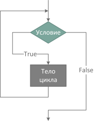

<style>
section {
  font-family: 'Roboto', 'Segoe UI', 'Liberation Sans', 'Helvetica', 'Arial', sans-serif !important;
  font-size: 1.55rem;
  padding: 3.5rem;
  justify-content: start;
}
</style>


<br>

# Системный анализ процессов переработки нефти и газа

## Лекция №1 - Основы программирования на языке Python

<br>
Вячеслав Алексеевич Чузлов

к.т.н., доцент ОХИ ИШПР ТПУ 

---


<!-- paginate: true -->


# Язык программирования Python

> **Python** – высокоуровневый язык программирования общего назначения с
динамической строгой типизацией и автоматическим управлением памятью,
ориентированный на повышение производительности разработчика, читаемости кода и его качества, а также на обеспечение кроссплатформенности написанных на нём программ.

<div class="columns">
<div>

## Установка
- Установить Python (https://www.python.org/). В OS X и Unix уже установлен.
- Только для Windows. При установке выбрать опцию с заданием переменных окружения (лучше установить пакет [Anaconda](https://www.anaconda.com/products/individual)).

</div>

<div>

## Среда разработки
- Для обучения, работы с данными и экспериментов с кодом: Jupyter Notebook из пакета [Anaconda](https://www.anaconda.com/products/individual).
- Текстовые редакторы: [Visual Studio Code](https://code.visualstudio.com/), Sublime, Atom, Notepad++ и др.
- IDE (Integrated Development Environment ): [PyCharm (Comunity Edition)](https://www.jetbrains.com/pycharm/download/#section=windows), Visual Studio, Spyder и др.

</div>

---

# Язык программирования Python

<div class="columns3">
<div>

## Кто использует Python
- Google
- YouTube
- Dropbox
- BitTorrent
- iRobot
- Netflix
- Intel
- Cisco
- NASA

</div>

<div>

## Сильные стороны
- Качество программного кода
- Продуктивность труда
- Кроссплатформенность
- Библиотеки

</div>

<div>


Индекс [TIOBE](https://www.tiobe.com/tiobe-index/) (январь 2024)

<div class="small-text">
<div>

|Позиция|ЯП      |Рейтинг|
|------:|:------ |-------:  |
|1      | Python  |13.97 %|
|2      | C       |11.44 %|
|3      | C++     |9.96 %|
|4      | Java    |7.87 %|
|5      | C#    |7.16 %|

</div>
</div>

---

<style scoped>
  section {
    justify-content: center;
    font-size: 30px
  }
</style>


# Типы данных

<!-- _paginate: skip -->

---

# Классификация объектов

Основные типы объектов в Python

|Тип объекта | Категория| Изменяемый? |
|-|-|-|
|Числа (`int`, `floar`, `complex`)|Числовые|Нет|
|Логический (`bool`)|Логические|Нет|
|Строки (`str`)|Последовательности|Нет|
|Списки (`list`)|Последовательности|Да|
|Словари (`dict`)|Отображения|Да|
|Кортежи (`tuple`)|Последовательности|Нет|
|Множества (`set`)|Множества|Да|

---


<style scoped>
  section {
    justify-content: center;
    font-size: 30px
  }
</style>


# Числовые типы

<!-- _paginate: skip -->

---

# Числовые типы

Числа в Python могут быть трех типов:
1. Целые числа (`int`);
2. Числа с плавающей точкой (`float`);
3. Комплексные числа (`complex`).

|Литерал|Расшифровка|
|-------|-----------|
|`1234`, `−24`, `0`, `99999999999999999`|Целые числа (неограниченный размер)|
|`1.23`, `1.`, `3.17e-10`, `4E210`, `4.0e+210`|Числа с плавающей точкой|
|`3+4j`, `3.0+4.0j`, `3J`|Литералы комплексных чисел|

---

# Арифметические операции с числами

Основные арифметические операции с числами:

|Приоритет|Операция|Описание|Тип операции|
|-:|:-:|-|:-|
|1|`x ** y`|Возведение в степень|Бинарная|
|2|`-x`, `+x`|Противоположность, идентичность|Унарная|
|3|`x / y`|Настоящее деление|Бинарная|
|3|`x // y`|Деление нацело|Бинарная|
|3|`x % y`|Остаток от деления (деление по модулю)|Бинарная|
|3|`x * y`|Умножение|Бинарная|
|4|`x - y`|Вычитание|Бинарная|
|4|`x + y`|Сложение|Бинарная|

---

# Оператор присваивания

Для выполнения операции присванивания в Python используется оператор `=`:

```py
x = 10
y = 20
print(x + y)  # 30
```

> **Составные операторы присваивания** - набор операторов, сочитающих в себе бинарную операцию и оператор присваивания.

```py
x = 1
x = x + 10  # Традиционное присваивание
print(x)  # 11
x += 10  # Составное присваивание
print(x)  # 21
```

Составные операторы присваивания:
`x += y` `x -= y` `x /= y` `x //= y`  `x %= y` `x *= y` `x **= y` 


---

<style scoped>
  section {
    justify-content: center;
    font-size: 30px
  }
</style>


# Логический тип данных

<!-- _paginate: skip -->

---

# Логический тип данных

- Для логического типа данных `bool` можно объявлять логические переменные, инициализируя их логическими значениями или присваивая им результат вычисления логических выражений.
- Логических констант в Python две: `True` (истина) и `False` (ложь).

```py
x = True
y = False
z = 2 > -1
print(x, y, z)  # True False True
```
---

# Операции сравнения

Логические выражения являются аналогом математической формулы, результатом его вычисления будет одна из двух логических констант – `True` или `False`.

<div class="columns">
<div>

|Операция|Описание|
|:-:|:-|
|`x < y`|Меньше|
|`x <= y`|Меньше или равно|
|`x > y`|Больше|
|`x >= y`|Больше или равно|
|`x == y`|Равно|
|`x != y`|Не равно|

</div>

<div>

> Приоритет операций сравнения **ниже**, чем у арифметических операций:

```py
print(2 + 3 * 5 > 7 / 2 + 3.5)  # True
```

Операции сравнения сравнивают относительные величины операндов и возвращают результат логического типа:

```py
# Больше или равно: int приводится к float
print(2.0 >= 1)  # True
# Значения равны
print(3.0 == 3.0)  # True
# Значения не равны
print(3.0 != 3.0)  # False
```
</div>

---

# Логическая операция `not`

- Унарная логическая операция `not` называется логическим отрицанием («НЕ», инверсия) и указывается перед логическим выражением для получения его противоположного значения.
- Приоритет операции `not` ниже, чем у операций сравнения, поэтому следующее за ней логическое выражение можно не заключать в скобки:

```py
print(3 + 5 >= 8)  # True
print(not 3 + 5 >= 8)  # False
```

---

# Логическая операция `or`

- Бинарная логическая операция `or` называется логическим сложением (логическое «ИЛИ»).
- Результатом операции or будет `False` только тогда, когда оба логических выражения будут иметь значения `False`, а в прочих случаях результатом будет `True`.

```py
print(9 + 3 < 10 or 2 + 2 == 4)  # True
print(4 + 2 < 0 or 10 * 2 >= 100)  # False
```
> Если выражение, стоящее слева от оператора `or` вернет `True`, то второе выражение вычисляться не будет:

```py
x = 10
y = 0
print(x or y)  # 10
```
> поэтому сложные проверки условий лучше ставить после оператора `or`.

---

# Логическая операция `and`

- Бинарная логическая операция `and` называется логическим умножением (логическое «И»).
- Результатом операции and будет `True` только тогда, когда оба логических выражения будут иметь значения `True`, а в прочих случаях результатом будет `False`.

```py
print(9 + 3 < 10 and 2 + 2 == 4)  # False
print(4 + 2 != 0 and 10 * 2 == 20)  # True
```

> Аналогично оператору `or`, Python не будет вычислять выражение справа от оператора `and`, если первое выражение вернуло `False`:

```py
x = 10
y = 0
print(y > x and x > y)  # False
```
---

# Приведение к логическому типу

- Конструктор типа `bool(x)` может использоваться для приведения любого значения к логическому типу (если это значение можно интерпретировать как логический тип). 
- Если аргумент `x` ложь или опущен, то будет возвращено значение `False`.

```py
print(bool(1), bool(‐1.0))  # True True
print(bool(0), bool(0.0))  # False False
print(bool())  # False
```

---

# Сцепленные операции сравнения

> В Python также есть возможность выстраивать цепочки из нескольких операторов сравнения для выполнения проверок вхождения в диапазон.
Сцепленные сравнения являются краткой записью для более массивных булевых выражений.

```py
print(x < y > z)  # False
print(x < y and y > z)  # False
print(3 < 6 < 9.0 < 12)  # True
print(3 > 6 > 9 > 12)  # False
```

---

<style scoped>
  section {
    justify-content: center;
    font-size: 30px
  }
</style>


# Строки

<!-- _paginate: skip -->

---

# Строки (str)

- Строки в Python относятся к <span style="color: #ffb600;">**неизменяемым последовательностям**</span>, что говорит о том, что содержащиеся в них символы имеют позиционный порядок слева направо и не могут быть изменены на месте.
- Строки в Python исполняют ту же роль, что и массивы символов в С-подобных языках, но в сравнении с массивами, они обладают инструментарием более высокого уровня.
- Строки в Python снабжены мощным набором инструментов обработки. Кроме того, в отличие от языков, подобных С, в Python не предусмотрен отдельный тип для индивидуальных символов, вместо этого применяются односимвольные строки.
- В плане обработки строки поддерживают операции <span style="color: #ffb600;">**выражений**</span>, такие как конкатенация (объединение строк), срезы (извлечение частей), индексация и т.д. Кроме операций выражений Python предоставляет набор <span style="color: #ffb600;"> **методов**</span> строк, которые реализуют общие задачи, специфичные для строк.

---

# Синтаксис строк

Python предлагает довольно обширный набор инструментов для работы со строками и в большинстве случаев использование строк проходит довольно легко. Вот несколько возможных способов записи строк в Python-коде:

- одинарные кавычки – `'spa"m'`
- двойные кавычки – `"spa'm"`
- тройные кавычки – `"""... spam ..."""`
- неформатированные строки – `r'C:\new\test.spm'`
- прочие способы записи строк.

Формы с одинарными и двойными кавычками, безусловно, являются наиболее популярными, другие используются в особых случаях.

---

# Операции над строками

1. Встроенная функция `len()` возвращает длину строки:
```py
print(len('abc'))  # 3
```

2. <span style="color: #ffb600;">**Конкатенация**</span> (сложение) строк выполняется при помощи операции `+` и создает новый объект строки с объединенным содержимым ее операндов:
```py
print('abc' + 'def')  # abcdef
```

3. Повторение выполняется при помощи операции `*` и идентично добавлению строки к самой себе несколько раз:
```py
# Повторение: то же, что 'Hi!' + 'Hi!' + ...
print('hi' * 4)  # Hi!Hi!Hi!Hi!
nC10 = 'CH3‐' + 'CH2‐' * 8 + 'CH3'
print(nC10)  # CH3‐CH2‐CH2‐CH2‐CH2‐CH2‐CH2‐CH2‐CH2‐CH3
```

---

# Сравнение строк

- Сравнение строк происходит последовательно: первый символ одной строки сравнивается с первым символом другой. Если они равны, сравниваются символы на следующей позиции.
- Для сравнения строк используются операторы `<`, `<=`, `>`, `>=`, `==`, `!=`

```py
# 'p' > 'P'
print('python' > 'Python')  # True
print(ord('p'), ord('P'))  # 112 80
```

- Проверка на <span style="color: #ffb600;">**идентичность**</span> проводиться при помощи оператора `is`: если имена указывают на один объект – оператор `is` вернет `True`, в противном случае – `False`:

```py
s1 = 'Python is the best!'
s2 = s1 # Создаем синоним s1: ссылка на один и тот же объект строки
s3 = 'Python is the best!' # Создаем новый объект
print(s1 == s2 == s3)  # True
print(s1 is s2)  # True
print(s1 is s3)  # False
print(id(s1), id(s3))  # 1971522386560 1971509687280
```

---

# Операции индексации

- Строки являются упорядоченными коллекциями символов и поэтому поддерживают доступ к своим элементам по индексу.
- <span style="color: #ffb600;">**Индексация**</span> – предоставление индекса желаемого компонента в квадратных скобках после имени, с которым связан объект строки. Результатом будет являться односимвольная строка в указанной позиции.
- Индексы в Python начинаются с `0` и заканчиваются величиной, на единицу меньше, чем длина строки.
- Python разрешает получать элементы из последовательностей с использованием
<span style="color: #ffb600;">**отрицательных**</span> индексов.
<!--  -->
<p align="center">
  
</p>

---

# Операции срезов

- **Срезы** – обобщенная форма индексации для получения целого <span style="color: #ffb600;">**сегмента**</span> вместо одиночного элемента.
- При выполнении среза Python извлекает элементы, начиная с нижней границы и заканчивая, но не включая верхнюю границу, и возвращает новый объект, содержащий извлеченные элементы.
- Если левая и/или правая границы не указаны, по умолчанию для них принимаются индексы `0` и длина последовательности, соответственно.

```py
s = 'chemistry'
print(s[1:3], s[1:], s[:‐1])  # he hemistry chemistr
```

---

# Расширенные срезы

- В Python для выражений срезов есть поддержка опционального третьего индекса, используемого в качестве <span style="color: #ffb600;">**шага**</span>;
- Шаг прибавляется к индексу каждого извлеченного элемента;
- Полная форма среза выглядит следующим образом:
$$
  x[i:j:k]
$$
что означает «извлечь элементы из `x`, начиная с индекса `i` и заканчивая индексом `j‐1`, с шагом `k`»;

- Третий предел, `k`, по умолчанию, равен `+1` и поэтому все элементы в срезе обычно извлекаются слева направо. Однако если указать явное значение, то можно применить третий предел для пропуска элементов или смены порядка их следования на противоположный.

---

# Расширенные срезы

- Например, `x[1:10:2]` вернет каждый второй элемент из `x` в рамках индексов $1\text{-}9$, т.е. элементы с индексами $1$, $3$, $5$, $7$ и $9$.
- По аналогии, верхний и нижний пределы по умолчанию принимаются равными `0` и длине последовательности, соответственно, поэтому `x[::2]` вернет каждый второй элемент с начала и до конца последовательности:

```py
s = 'Beautifulisbetterthanugly'
# Пропуск элементов
print(s[1:10:2])  # euiui
print(s[::2])  # Batflsetrhngy
```

---

# Расширенные срезы

- Можно также использовать отрицательный шаг для получения элементов в обратном порядке. Например, выражение среза `'spam'[::‐1]` вернет новую строку `'maps'` – шаг `-1` указывает, что срез должен идти справа налево, а не слева направо:

```py
s = 'spam'
# Смена порядка элементов на противоположный
print(s[::‐1])  # maps
```

- При отрицательном шаге смысл нижней и верхней границ по сути меняется на
противоположный. Таким образом, срез `x[5:1:‐1]` получает элементы со второго по пятый в обратном порядке (элементы с индексами $5$, $4$, $3$ и $2$):

```py
s = 'Simpleisbetterthancomplex'
# Смысл границ изменяется
print(s[5:1:‐1])  # elpm
```

---

# Методы строк

Ниже имя `s` – это объект строки, а опциональные (необязательные) аргументы указаны в квадратных скобках. Для получения полного списка используйте `dir()` или `help()`.

<div class="columns">
<div>

`s.capitalize()`
`s.casefold()`
`s.center(width[, fillchar])`
`s.count(sub[, start[, end]])`
`s.endswith(suffix[, start[, end]])`
`s.find(sub[, start[, end]])`
`s.format(*args, **kwargs)`
`s.format_map(mapping)`
`s.index(sub[, start[, end]])`
`s.isalnum()`
`s.isalpha()`
`s.isascii()`
`s.isdecimal()`

</div>

<div>

`s.isdigit()`
`s.lower()`
`s.islower()`
`s.isnumeric()`
`s.istitle()`
`s.removeprefix(prefix)`
`s.removesuffix(suffix)`
`s.replace(old, new[, count])`
`s.isupper()`
`s.split(sep=None, maxsplit=‐1)`
`s.startswith(prefix[, start[, end]])`
`s.join(iterable)`
`s.upper()`

</div>

---

# Форматированные строки (f-строки)

- Литерал форматированных строк или f-строки – это строковый литерал с префиксом `f` или `F`. Данные строки могут содержать замещающие поля, которые являются выражениями в фигурных скобках `{}`.
- Мини-язык для спецификатора формата такой же, как и в методе `format()`.

```py
print(f'{1.2354:.2f}')  # 1.24
print(f'{1.2354:e}')  # 1.235400e+00
print(f'{1.2354:.3e}')  # 1.235e+00
print(f'{1.2354:g}')  # 1.2354
```

---

<style scoped>
  section {
    justify-content: center;
    font-size: 30px
  }
</style>


# Списки

<!-- _paginate: skip -->

---

# Списки (list)

- Списки в Python – наиболее гибкая разновидность объектов упорядоченных коллекций.
- Списки могут содержать объекты любого типа: строки, числа или другие списки.
- Списки <span style="color: #ffb600;">**можно изменять**</span> на месте присваиванием по индексам, с использованием срезов, вызвав специальные методы или выполнив оператор удаления.

|Операция|Описание|
|:-|:-|
|`a = []` `a = list()`|Создание пустого списка|
|`a = [123, 'abc', 1.354, []]`|Четыре элемента: индексы 0...3|
|`a = ['Joe', 30.0, ['dev', 'prof']]`|Вложенные списки|
|`a = list('hello')`|Список элементов итерируемого объекта|
|`a = list(range(‐5, 6))`|Список последовательных целых чисел|
|`a[i]`|Индекс|

---

# Списки (list)


|Операция|Описание|
|:-|:-|
|`a[i][j]`|Индекс вложенного списка|
|`a[i:j]`|Срез|
|`len(a)`|Длина|
|`a1 + a2`|Конкатенация|
|`a * 3`|Повторение|
|`x in a`|Вхождение|
|`a.append(5)`|Добавление элемента в конец списка|
|`a.extend([10, 20, 30])`|Добавление списка в конец исходного списка|

---

# Генераторы списков (list comprehension)

<span style="color: #ffb600;">**Генераторы списков**</span> – это способ создания нового списка с применением выражения к каждому элементу последовательности (по факту в любом итерируемом объекте).

```py
chars = [c * 4 for c in 'HELLO']
print(chars)  # ['HHHH', 'EEEE', 'LLLL', 'LLLL', 'OOOO']
```

- Генераторы списков записываются более кратко и выполняются чуть быстрее.
- В сложных случаях лучше использовать цикл `for` из-за его более высокой читаемости.

```py
chars = []

for c in 'HELLO':
  chars.append(c * 4)

print(chars)  # ['HHHH', 'EEEE', 'LLLL', 'LLLL', 'OOOO']
```

---

# Индексация и срезы

- Индексация и срезы для списков работают аналогично тому, как это было описано для объектов строк.
- Результатом индексации списка может быть объект любого типа, находящийся по указанному индексу, тогда как срезы всегда возвращают новый объект списка.
  
```py
fruits = ['banana', 'orange', 'apple']

# Индексы начинаются с нуля
print(fruits[2])  # 'apple'

# Отрицательные индексы отсчитываются справа
print(fruits[‐2])  # 'orange'

# Срезы получают сегменты
print(fruits[1:3])  # ['orange', 'apple']

# Результат среза всегда новый список
print(fruits[‐1:])  # ['apple']
```

---

# Вложенность списков

- Внутри списков могут содержаться вложенные списки или объекты других типов.
- Матрицы в Python можно представить в виде вложенных списков. Пример матрицы $3 \times 3$:

```py
matrix = [[10, 20, 30], [40, 50, 60], [70, 80, 90]]
```

- Если указать один индекс, то будет получена целая строка, а при указании двух индексов
будет возвращен элемент строки:

```py
print(matrix[1])  # [40, 50, 60]
print(matrix[2][0])  # 70
matrix = [[10, 20, 30],
          [40, 50, 60],
          [70, 80, 90]]
print(matrix[1][1])  # 50
```

---

# Изменение списков

- Так как списки – <span style="color: #ffb600;">**изменяемый**</span> тип объектов, для них определены операции, которые могут модифицировать объект списка на месте.
- Операции модифицирования списков изменяют объект списка напрямую, перезаписывая его старое значение, без необходимости создания новой копии, как в случае работы со строками.

**Присваивание по индексам и срезам**

```py
food = ['burger', 'pizza', 'buritto']

food[1] = 'toast' # Присваивание по индексу
print(food)  # ['burger', 'toast', 'buritto']

food[:2] = ['need', 'more']  # Присваивание срезу
print(food)  # ['need', 'more', 'buritto']
```

---

# Примеры присваиваний по срезу
<br>

```py
a = [10, 20, 30]

a[1:2] = [4, 5]  # Замена/вставка
print(a)  # [10, 4, 5, 30]

a[1:1] = [60, 70]  # Вставка (ничего не заменяется)
print(a)  # [10, 60, 70, 4, 5, 30]

a[1:2] = []  # Удаление (ничего не добавляется)
print(a)  # [10, 70, 4, 5, 30]

a[:0] = [1, 2, 3] # Вставка на место :0, пустой срез в начале
print(a)  # [1, 2, 3, 10, 70, 4, 5, 30]

a[len(a):] = [4, 5, 6] # Вставка на место len(a):, пустой срез в конце
print(a)  # [1, 2, 3, 10, 70, 4, 5, 30, 4, 5, 6]
```

---

# Вызовы методов списков

- Подобно строкам, списки имеют набор специфичных методов, многие из которых ведут к изменению исходного списка на месте:

```py
a = ['eat', 'more', 'SPAM']

a.append('please')
print(a)  # ['eat', 'more', 'SPAM', 'please']
```

- Наиболее распространенный метод – `append()` добавляет объект в конец списка.
- Эффект выполнения выражения `a.append(x)` аналогичен `a + [x]` с одним
принципиальным отличием: первый вариант изменяет a на месте, а второй вариант создает новый объект списка.

---

# Вызовы методов списков

- Метод `extend()` добавляет множество элементов в конец списка;
- Метод `pop()` удаляет и возвращает последний элемент списка, если не указан индекс;
- Метод `reverse()` изменяет порядок элементов в списке на противоположный (обращает список) на месте.

```py
a = [0, 1]

a.extend([2, 3, 4])  # Добавление множества элементов в конец списка
print(a)  # [0, 1, 2, 3, 4]

x = a.pop()  # Удаление и возврат последнего элемента
print(x)  # 4
print(a)  # [0, 1, 2, 3]

a.reverse()  # Метод обращения списка на месте
print(a)  # [3, 2, 1, 0]
```

---

# Вызовы методов списков

<div class="columns">
<div>

- `index()` – нахождение индекса элемента;
- `insert()` – вставка элементов по индексу;
- `remove()` – удаление элементов списка;

</div>

<div>

- `pop(i)` – удаляет и возвращает элемент по индексу `i`;
- `count()` – подсчет количества вхождений.

</div>
</div>

<div class="columns">
<div>

```py
a = ['spam', 'eggs', 'ham']

i = a.index('spam')  # Поиск индекса объекта
print(i)  # 0

a.insert(1, 'toast')  # Вставка по индексу
print(a)  # ['spam', 'toast', 'eggs', 'ham']

a.remove('spam')  # Удаление по значению
print(a)  # ['toast', 'eggs', 'ham']
```

</div>

<div>

```py
x = a.pop(1)  # Удаление по индексу
print(x)  # 'eggs'
print(a)  # ['toast', 'ham']

c = a.count('ham')  # Количество вхождений
print(c)  # 1


```

</div>
</div>

---

# Метод `sort()`

- Для сортировки элементов списка по возрастанию достаточно вызвать метод `sort()`.
- Метод `sort()` изменяет исходный список (и возвращает `None`):

```py
a = [5, 2, 3, 1, 4]
a.sort()
print(a)  # [1, 2, 3, 4, 5]

a = [10, 5, 4, 20, 50]
x = a.sort()
print(x)  # None
print(a)  # [4, 5, 10, 20, 50]
```

---

# Метод `sort()`

- Отсортировать можно те списки, элементы которых можно сравнить друг с другом:

```py
a = ['a', 'B', 'C', 'b', 'c', 'A']
a.sort()
print(a)  # ['A', 'B', 'C', 'a', 'b', 'c']

a = [[1, 2, 3], [3, 2, 1], [2, 3, 1]]
a.sort()
print(a)  # [[1, 2, 3], [2, 3, 1], [3, 2, 1]]

a = [1, [20.5, 10], 'A', ‐5]
a.sort()  # TypeError: '<' not supported between instances of 'list' and 'int'
```

---

# Дополнительные сведения о методе `sort()`

- Аргумент `reverse` позволяет сортировку по убыванию, а параметр `key` принимает функцию с одним аргументом, возвращающую значение, используемое при сортировке.


```py
a = [‐10, 5, 20, ‐3, 10]
a.sort()  # Сортировка с учетом знака
print(a)  # [‐10, ‐3, 5, 10, 20]

a.sort(reverse=True)  # Сортировка в порядке убывания
print(a)  # [20, 10, 5, ‐3, ‐10]

a.sort(key=abs)  # Сортировка без учета знака
print(a)  # [‐3, 5, ‐10, 10, 20]

a.sort(key=abs, reverse=True) # Изменение порядка сортировки
print(a)  # [20, ‐10, 10, 5, ‐3]
```

---

<style scoped>
  section {
    justify-content: center;
    font-size: 30px
  }
</style>


# Кортежи

<!-- _paginate: skip -->

---

# Кортежи (tuple)

- Кортежи служат для хранения нескольких объектов вместе.
- Аналог списков, но без обширной функциональности. Кортежи <span style="color: #ffb600;">**неизменяемы**</span>.

|Операция |Интерпретация|
|:-|:-|
|`t = ()` `t = tuple()`|Создание пустого кортежа|
|`t = (0, )`|Одноэлементный кортеж (не выражение)|
|`t = (0, 'Hi', 1.2, 3)`|Кортеж из четырех элементов|
|`t = 0, 'Hi', 1.2, 3`|Такой же кортеж, как в предыдущей строке|
|`t = ('John', ('prof', 'dev'))`|Вложенные кортежи|
|`t = tuple('hello')`|Кортеж из элементов итерируемого объекта|
|`t[i]`|Индекс|

---

# Кортежи (tuple)


|Операция |Интерпретация|
|:-|:-|
|`t[i][j]`|Индекс вложенного кортежа|
|`t[i:j]`|Срез|
|`len(t)`|Длина кортежа|
|`t1 + t2`|Конкатенация|
|`t * 3`|Повторение|
|`'spam' in t`|Проверка вхождения|
|`t.index('Hi')`|Поиск индекса элемента|
|`t.count('hello')`|Подсчет повторений элемента|

---

# Операции над кортежами

- Кортежи поддерживают обычные операции, специфичные для последовательностей:
```py
# Конкатенация
print((10, 20) + (30, 40))  # (10, 20, 30, 40)

# Повторение
print((1, 2) * 5)  # (1, 2, 1, 2, 1, 2, 1, 2, 1, 2)

# Сравнение
print((10, 20) < (20, 30) < (30, 40))  # True

t = (10, 20, 30, 40, 50)

# Индексация, срезы
print(t[0], t[1:3])  # 10 (20, 30)
```

---

# Операции над кортежами

- Создание кортежа из одного элемента:

```py
x = (30)  # Целое число
print(x)  # 30
print(type(x))  # <class 'int'>
y = (30, )  # Кортеж, содержащий целое число
print(y)  # (30,)
print(type(y))  # <class 'tuple'>
```

- Сортировка кортежа

```py
t = ('b', 'c', 'a', 'e', 'd')
tmp = list(t)  # Создание списка из элементов кортежа
tmp.sort()  # Сортировка списка
print(tmp)  # ['a', 'b', 'c', 'd', 'e']
t = tuple(tmp)  # Создание кортежа из элементов списка
print(t)  # ('a', 'b', 'c', 'd', 'e')
```

---

# Преобразование кортежей

- Преобразовать элементы кортежа можно при помощи выражения генератора списка, либо при помощи итерации по его элементам в цикле `for`:

<div class="columns">
<div>

С использованием генератора списка:
```py
t = (1, 2, 3, 4, 5)

a = [x ** 3 for x in t]
print(a)  # [1, 8, 27, 64, 125]

t = tuple(a)
print(t)  # (1, 8, 27, 64, 125)


```
</div>
<div>

С использованием цикла `for`:
```py
t = (1, 2, 3, 4, 5)

a = []
for number in t:
    a.append(number ** 3)
print(a)  # [1, 8, 27, 64, 125]

t = tuple(a)
print(t)  # (1, 8, 27, 64, 125)
```
</div>

---

# Преобразование кортежей

> Изменять элементы кортежей по индексу, как и элементы строк, **нельзя**:

```py
t = (1, 2, 3, 4, 5)
t[1] = 'hi!'  # TypeError: 'tuple' object does not support item assignment

s = 'compound'
s[3] = 'b'  # TypeError: 'str' object does not support item assignment
```

---

<style scoped>
  section {
    justify-content: center;
    font-size: 30px
  }
</style>


# Словари

<!-- _paginate: skip -->

---

# Словари (dict)

- Элементы словарей хранятся и извлекаются по <span style="color: #ffb600;">**ключам**</span>, а не по индексам.
- Словари не сохраняют порядок следования своих элементов в отличие от списков.
- Поиск элементов в словаре по ключу - крайне быстрая операция, т.к. словари - максимально оптимизированная структура данных.

|Операция|Интерпретация|
|:-|:-|
|`d = {}` `d = dict()`|Создание пустого словаря|
|`d = {'name': 'John', 'age': 35}`|Словарь из двух элементов|
|`d1 = {'person': {'name': 'John', 'age': 35}}`|Вложенный словарь|
|`d = dict(name='John', age=35)`|Создание словаря по ключевым словам|
|`d = dict([('name', 'John'), ('age', 40)])`|Создание словаря по парам «ключ:значение»|
|`d = dict.fromkeys(['name', 'age'])`|Создание словаря по списку ключей|


---

# Словари (dict)

|<div style="width:350px">Операция</div>|Интерпретация|
|:-|:-|
|`d['name']`|Индексирование по ключу|
|`d1['person']['age']`|Индексирование по ключу дважды  для доступа к вложенным объектам|
|`'age' in d`|Проверка наличия ключа|
|`d.keys()`|Получить все ключи (в виде словарного представления)|
|`d.values()`|Получить все значения (в виде словарного представления)|
|`d.items()`|Получить все пары «ключ: значение» (в виде словарного представления)|
|`d.copy()`|Копирование|
|`d.clear()`|Удаление всех элементов|

---

# Словари (dict)

|<div style="width:350px">Операция</div>|Интерпретация|
|:-|:-|
|`d.update(d2)`|Объединение по ключам|
|`d.get(key, default)`|Извлечение по ключу, если ключ отсутствует – возвращается стандартное значение или `None`|
|`d.pop(key, default)`|Удаление по ключу, если ключ отсутствует – возвращается стандартное значение или вызывается (ошибка)|
|`d.setdefault(key, default)`|Установить по ключу, если ключ отсутствует – установить стандартное значение или `None`|
|`d.popitem()`|Удаление и возвращение любой пары «ключ: значение»|
|`len(d)`|Длина (количество сохраненных элементов)|


---

# Словари (dict)

|<div style="width:350px">Операция</div>|Интерпретация|
|:-|:-|
|`d[key] = 32`|Добавление ключей или изменение значений, связанных с ключами|
|`del d[key]`|Удаление элемента по ключу|
|`list(d.keys())`|Получить список ключей|
|`list(d.values())`|Получить список значений|
|`list(d.items())`|Получить список пар "ключ:значение"|


---

# Распространенные методы словарей

- Методы `values()` и `items()` возвращают, соответственно, значения словаря и список кортежей с парами «ключ: значение».
- Совместно с методом `keys()` их удобно использовать в циклах, которые нужны для прохода по элементам.
- Как и метод `keys()`, методы `values()` и `items()` возвращают итераторы, поэтому их вызовы помещены в функцию `list()`:

```py
d = {'spam': 4, 'ham': 1, 'eggs': 2}

values_list = list(d.values())
print(values_list)  # [4, 1, 2]

items_list = list(d.items())
print(items_list)  # [('spam', 4), ('ham', 1), ('eggs', 2)]
```

---

# Распространенные методы словарей

- Во многих случаях невозможно предугадать содержимое словаря до запуска программы или при написании кода.
- Извлечение по несуществующему ключу интерпретируется как ошибка, однако метод `get()` возвращает в таких случаях стандартное значение – `None` или переданное ему значение.

```py
print(d.get('spam'))  # 4
print(d.get('banana'))  # None
value = d.get('banana', 'Empty')
print(value)  # Empty
```

- Метод `update()` объединяет ключи и значения одного словаря с ключами и значениями другого словаря, переписывая значения одинаковых ключей:

```py
d = {'buritto': 2, 'burger': 3}
d1 = {'pizza': 2, 'nachos': 5}
d.update(d1)
print(d)  # {'buritto': 2, 'burger': 3, 'pizza': 2, 'nachos': 5}
```

---

# Инициализация словарей

- Объединение его ключей и значений при помощи функции `zip()` с последующей передачей результата вызову `dict()`:

```py
keys_and_values = list(zip(['a', 'b', 'c'], [1, 2, 3]))  # Упаковка ключей и значений
print(keys_and_values)  # [('a', 1), ('b', 2), ('c', 3)]

d = dict(zip(['a', 'b', 'c'], [1, 2, 3]))
print(d)  # {'a': 1, 'b': 2, 'c': 3}
```

---

# Генераторы словарей (dict comprehension)

- Генераторы словарей выполняют подразумеваемый цикл, накапливая на каждом шаге результаты «ключ: значение» и используя их для заполнения нового словаря:

```py
d = {k: v for k, v in zip(['a', 'b', 'c'], [1, 2, 3])}
print(d)  # {'a': 1, 'b': 2, 'c': 3}

d = {x: x ** 2 for x in [1, 2, 3, 4, 5]}
print(d)  # {1: 1, 2: 4, 3: 9, 4: 16, 5: 25}

d = {c: c * 5 for c in 'hello'}
print(d)  # {'h': 'hhhhh', 'e': 'eeeee', 'l': 'lllll', 'o': 'ooooo'}

fruits = {fruit.upper(): fruit + '!' for fruit in ['banana', 'orange', 'apple']}
print(fruits)  # {'BANANA': 'banana!', 'ORANGE': 'orange!', 'APPLE': 'apple!'}
```

---

# Генераторы словарей (dict comprehension)

- Генераторы словарей также удобно использовать при инициализации словарей из списка ключей, во многом подобно тому, как это можно реализовать при помощи метода `fromkeys()`:

```py
d = dict.fromkeys(['a', 'b', 'c', 'd'], ‐1) # Инициализация из ключей и значения ‐1
print(d)  # {'a': ‐1, 'b': ‐1, 'c': ‐1, 'd': ‐1}

d = {key: ‐1 for key in ['a', 'b', 'c', 'd']}
print(d)  # {'a': ‐1, 'b': ‐1, 'c': ‐1, 'd': ‐1}

d = dict.fromkeys('hello')  # Другой итерируемый объект и значение по умолчанию
print(d)  # {'h': None, 'e': None, 'l': None, 'o': None}

d = {key: None for key in 'hello'}
print(d)  # {'h': None, 'e': None, 'l': None, 'o': None}
```

---

<style scoped>
  section {
    justify-content: center;
    font-size: 30px
  }
</style>


# Множества

<!-- _paginate: skip -->

---

# Множества (set)

- <span style="color: #ffb600;">**Множество**</span> представляет собой неупорядоченную коллекцию **уникальных** элементов, являющихся неизменяемыми объектами.
- Элемент встречается во множестве только один раз, в независимости от того, сколько раз он был добавлен.
- Поскольку множества представляют собой коллекции других элементов, они разделяют некоторые свойства и поведение с такими типами, как **списки** и **словари**. Например, множества являются **итерируемыми объектами**, их можно увеличивать и уменьшать по требованию, в них можно добавлять объекты других типов.
- Множества не сохраняют порядок следования элементов и не отображают ключи на значения.
- Множества являются <span style="color: #ffb600;">**изменяемыми объектами**</span> и не могут быть вложенны в другие множества.

---

# Создание объектов множеств

- Для создания объекта множества можно вызвать функцию `set()` и передать ей любой тип последовательности или другой итерируемый объект.
- В качестве результата будет получен объект множества, содержащий все элементы из переданного объекта (порядок элементов может варьироваться):

```py
x = set('hello')
print(x)  # {'l', 'h', 'e', 'o'}
```

- Для создания объектов множеств можно также использовать форму литералов множеств, применяя фигурные скобки `{}`. Следующие операторы эквивалентны:

```py
s = set([10, 20, 30, 40, 50])
print(s)  # {40, 10, 50, 20, 30}

s = {10, 20, 30, 40, 50}
print(s)  # {40, 10, 50, 20, 30}
```

---

# Создание объектов множеств

- Множества по сути похожи на <span style="color: #ffb600;">**словари без значений**</span>, т.к. элементы множеств не сохраняют порядок и в целом ведут себя похоже на ключи словаря.
- Обратите внимание на то, что пустые фигурные скобки `{}` – это операция, создающая пустой словарь.
- Пустые множества должны создаваться при помощи встроенной функции `set()`:

```py
s = {10, 20, 30, 40}

print(s - {10, 20, 30, 40})  # set()

# {} ‐ это пустой словарь
print(type({}))  # <class 'dict'>

s = set()  # Создание пустого множества
s.add(100)
print(s)  # {100}
```

---

# Операции и методы множеств


|Метод / операция|Описание|
|:-:|:-|
|`s1.union(s2)` <br> `s1 \| s2`|Возвращает множество, являющееся объединением множеств `s1` и `s2`|
|`s1.update(s2)` <br> `s1 \|= s2`|Добавляет в множество `s1` все элементы из множества `s2`|
|`s1.intersection(s2)` <br> `s1 & s2`|Возвращает множество элементов, которые есть во множествах `s1` и `s2`|
|`s1.intersection_update(s2)` <br> `s1 &= s2`|Оставляет в множестве `s1` только те элементы, которые есть во множестве `s2`|
|`s1.difference(s2)` <br> `s1 - s2`|Возвращает разность множеств `s1` и `s2` (элементы, входящие в `s1`, но не входящие в `s2`)|

---

# Операции и методы множеств

|Метод / операция|Описание|
|:-:|:-|
|`s1.difference_update(s2)` <br> `s1 -= s2`|Удаляет из множества `s1` все элементы, входящие в `s2`|
|`s1.symmetric_difference(s2)` <br> `s1 ^ s2`|Возвращает симметрическую разность множеств `s1` и `s2` (элементы, входящие в `s1` или в `s2`, но не в оба из них одновременно)|
|`s1.symmetric_difference_update(s2)` <br> `s1 ^= s2`|Записывает в `s1` симметрическую разность множеств `s1` и `s2`|
|`s1.issubset(s2)` <br> `s1 <= s2`|Возвращает `True`, если `s1` является подмножеством `s2`|
|`s1.issuperset(s2)` <br> `s2 >= s2`|Возвращает `True`, если `s2` является подмножеством `s1`|


---

# Генераторы множеств

- Выражение генератора множеств по форме похоже на выражение генератора списков, однако записывается в фигурных, а не квадратных скобках.
- Генераторы множеств запускают цикл и на каждой его итерации накапливают результат выражения. Результатом является новый объект множества.

```py
s = {x ** 2 for x in [10, 20, 30, 40, 50]}
print(s)  # {1600, 900, 2500, 100, 400}
```

- Генераторы множеств могут также выполнять проход по объектам других типов, таких, как строки:

```py
s = {x for x in 'hello'}
print(s)  # {'l', 'h', 'e', 'o'}

s = {c * 5 for c in 'SPAM!'}
print(s)  # {'!!!!!', 'SSSSS', 'AAAAA', 'MMMMM', 'PPPPP'}
```

---

# Примеры использования множеств

- Фильтрация дубликатов в коллекциях:

```py
a = [1, 2, 2, 3, 5, 4, 1, 1, 2, 5, 4]
a = list(set(a))
print(a)  # [1, 2, 3, 4, 5]
a = list(set(['hh', 'ee', 'll', 'll', 'oo'])) # Порядок не сохраняется
print(a)  # ['oo', 'hh', 'll', 'ee']
```

- Нахождении различий в списках, строках и прочих итерируемых объектах,

```py
a = [1, 2, 3, 4, 5, 7]
a2 = [1, 2, 4, 5, 6]
dif = set(a) ‐ set(a2)  # Различия в списках
print(dif)  # {3, 7}
s1 = 'spam'
s2 = 'ham'
dif = set(s1) ‐ set(s2)  # Различия в строках
print(dif)  # {'s', 'p'}
dif = set('tomato') ‐ set(['p', 'o', 't', 'a', 't', 'o'])  # Объекты разных типов
print(dif)  # {'m'}
```

---

# Примеры использования множеств

- Множества также можно применить для проверок на **равенство, нейтральное к порядку**.
- Два множества равны только в том случае, когда каждый элемент одного множества содержится в другом, иначе говоря, одно множество является подмножеством другого.
- К примеру, такой прием можно использовать для сравнения выводов программ, которые должны работать одинаковым образом, но могут генерировать результаты в разном порядке:

```py
a1, a2 = [1, 2, 3, 5, 4, 6], [2, 5, 3, 4, 1, 6]
# Порядок следования имеет значение
print(a1 == a2)  # False

# Проверка, нейтральная к порядку элементов
print(set(a1) == set(a2))  # True

print('hello' == 'olleh')  # False
print(set('hello') == set('olleh'))  # True
```

---

# Примеры использования множеств

- Множества удобны при работе с большими данными, например, запросами к базе данных.
- **Пересечение** множеств содержит общие элементы этих множеств, а **объединение** – все элементы множеств.

```py
engineers = {'Petr', 'Ivan', 'Fedor', 'Anna', 'Victoriya'}
managers = {'Petr', 'Anna', 'Boris'}
# Является ли сотрудник инженером?
print('Fedor' in engineers)  # True
# Кто одновременно инженер и менеджер?
print(engineers & managers)  # {'Anna', 'Petr'}
# Все сотрудники из двух категорий
print(engineers | managers)  # {'Anna', 'Boris', 'Fedor', 'Petr', 'Ivan', 'Victoriya'}
# Инженеры, не являющиеся менеджерами
print(engineers ‐ managers)  # {'Ivan', 'Fedor', 'Victoriya'}
# Все ли инженеры ‐ менеджеры?
print(engineers >= managers)  # False
# Оба ли сотрудника инженеры?
print({'Fedor', 'Anna'} <= engineers)  # True
# Кто находится только в одной категории?
print(managers ^ engineers)  # {'Boris', 'Fedor', 'Ivan', 'Victoriya'}
```

---

<style scoped>
  section {
    justify-content: center;
    font-size: 30px
  }
</style>


# Операторы управления <br> потоком команд

<!-- _paginate: skip -->

---


# Оператор `if`

- Оператор `if` используется для проверки условий: **если** условие верно, то выполняется блок выражений (называемый «if-блок»), **иначе** выполняется другой блок выражений (называемый «else-блок»).
- Блок `else` является необязательным.

```py
if 1:
  print('True')  # True
```

Напоминаем, что $1$ – это `True`, таким образом, проверка в операторе всегда проходит. Для обработки ложного результата понадобится добавить часть `else`:

```py
if not 1:
    print('true')
else:
    print('false')  # false
```

---

# Множественное ветвление

Рассмотрим пример оператора `if`, содержащего все необязательные части:

```py
number = 23
guess = int(input('Введите целое число: '))

if guess == number:
    print('Поздравляю, Вы угадали,') # Здесь начинается новый блок
    print('хотя и не выиграли никакого приза!') # Конец нового блока

elif guess < number:
    print('Нет, загаданное число немного больше этого.') # Ещё один блок: внутри можно выполнять любые операторы

else:
    print('Нет, загаданное число немного меньше этого.')
```

- Интерпретатор выполняет операторы, вложенные внутрь первой проверки, которая вернет `True`, или часть `else`, если все проверки вернули `False`.
- Части `elif` и `else` могут быть опущены, а в каждой части допускается указывать более одного вложенного оператора.
- Части `if`, `elif` и `else` связываются друг с другом одинаковыми отступами.

---

# Тернарное выражение `if`/`else`

- Зачастую элементы, использованные в операторе `if`, достаточно просты, так что распространение такого оператора на четыре строки выглядит излишеством.
- В других случаях конструкцию подобного рода может понадобиться вложить в более крупный оператор, а не присваивать ее результат какой-то переменной.
- По указанным причинам в Python был добавлен новый формат условного выражения, который позволяет определить то же самое в одном действии (тернарный оператор).

<div class="columns">
<div>

```py
if x:
    a = y
else:
    a = z
```

</div>

<div>

```py
a = y if x else z


```

</div>
</div>

> Использовать тернанрый оператор нужно крайне умеренно и только в тех случаях, когда все его составные части относительно просты, иначе  редпочтительнее использовать форму полного оператора `if` для облегчения его будущего модифицирования.

---

<style scoped>
  section {
    justify-content: center;
    font-size: 30px
  }
</style>


# Операторы цикла в Python

<!-- _paginate: skip -->

---

# Операторы цикла

- Алгоритмы решения многих задач требуют некоторого количества повторений своих отдельных частей.
- Такие повторяющиеся участки называют циклическими, а операторы языка Python, реализующие соответствующие повторения – <span style="color: #ffb600;">**операторами цикла**</span>.
- Цикл состоит из <span style="color: #ffb600;">**заголовка цикла**</span> и <span style="color: #ffb600;">**тела цикла**</span>.
- Заголовок определяет условие прекращения (или выполнения) цикла, а тело цикла содержит операторы, которые нужно повторять.

Операторы цикла в Python:
1. Цикл `while`
2. Цикл `for`

---

# Оператор цикла `while`



- Оператор `while` многократно повторяет блок операторов до тех пор, пока проверка в заголовочной части оценивается как истина.
- Управление продолжает возвращаться к началу оператора, пока проверка не даст ложное значение. Когда результат проверки становится ложным, управление переходит на оператор, следующий после блока `while`.
- Если проверка оценивается в ложное значение с самого начала, тогда тело
цикла никогда не выполнится и оператор `while` пропускается.

---

# Оператор цикла `while`

Общий формат цикла `while`:

```py
while expression:  # Проверка цикла
    operator_1  # Тело цикла
    operator_2
    ...
    operator_n
```

Цикл `while` можно использовать:

- в математических итерационных алгоритмах для проведения вычислений с заданной точностью;
- при вводе данных, когда их количество заранее неизвестно, а условие завершения ввода определено некоторым введенным значением;
- при поиске нужного элемента в какой-либо структуре данных.


---

# Примеры использования цикла `while`

Вывод чисел в диапазоне $[0; 10)$ с шагом $1$:

```py
a, b = 0, 10

while a < b:
    print(a, end='')
    a += 1

# 0123456789
```

---

# Примеры использования цикла `while`


```py
number = 24
running = True

while running:
    guess = int(input('Введите целое число: '))

    if guess == number:
        print('Поздравляем, Вы угадали!')
        running = False  # это останавливает цикл while

    elif guess < number:
        print('Нет, загаданное число немного больше этого')

    else:
        print('Нет, загаданное число немного меньше этого')

print('Завершение.')  # другие операторы программы

# Введите целое число: 12
# Введите целое число: 24
# Поздравляем, Вы угадали!
# Завершение.
```

---

# Оператор цикла `for`

- Оператор `for`...`in` также является оператором цикла, который осуществляет итерацию по <span style="color: #ffb600;">**последовательности**</span> объектов, т.е. проходит через каждый элемент в последовательности.
- <span style="color: #ffb600;">**Последовательность**</span> – это упорядоченный или неупорядоченный набор элементов.
- Во многих случаях в заголовке цикла `for` используется функция `range()`, которая является генератором арифметических прогрессий:

```py
for i in range(10):  # 10 не включительно
    print(i, end=' ')  # 0 1 2 3 4 5 6 7 8 9

for i in range(1, 11):  # можно задать начальное значение
    print(i, end=' ')  # 1 2 3 4 5 6 7 8 9 10

for i in range(0, 11, 2):  # также можно менять шаг
    print(i, end=' ')  # 0 2 4 6 8 10
```

---

# Вложенные циклы `for`

Операторы цикла `for` могут быть вложены друг в друга на произвольную глубину:

```py
for i in range(3):
    for j in range(3):
        if i != j:
            print(i, j, round(1 / (i + j), 2))

# 0 1 1.0
# 0 2 0.5
# 1 0 1.0
# 1 2 0.33
# 2 0 0.5
# 2 1 0.33
```

---

<style scoped>
  section {
    justify-content: center;
    font-size: 30px
  }
</style>


# Операторы `break`, `continue`, `pass` и конструкция `else` цикла

<!-- _paginate: skip -->

---

# Оператор `break`

Оператор `break` выполняет немедленный выход из цикла, т.е. остановку выполнения команд, даже если условие выполнения цикла еще не приняло значение `False` или последовательность элементов не закончилась.

```py
while True:
    name = input('Enter name: ')
    if name == 'stop':
      break
    age = input('Enter age: ')
    print('Hello', name, '=>', int(age) * 2)

# Enter name: John
# Enter age: 35
# Hello John => 70
# Enter name: Julya
# Enter age: 24
# Hello Julya => 48
# Enter name: stop
```

---

# Оператор `continue`

Оператор `continue` используется для немедленного перехода в начало цикла.

<div class="columns">

<div>

```py
x = 10

while x:
    x ‐= 1
    
    if x % 2:  # Нечетное? Тогда пропустить
        continue
    
    print(x, end=' ')

# 8 6 4 2 0
```

</div>

<div>

```py
x = 10

while x:
    x ‐= 1
    
    if not x % 2:  # Четное? Тогда выводим
        print(x, end=' ')


# 8 6 4 2 0
```

</div>

</div>

---

# Оператор `pass`

- Оператор `pass` – это заполнитель, обозначающий отсутствие действий, используемый в ситуациях, когда синтаксис требует оператора, но нет возможности выполнить что-либо полезное.
- Данный оператор часто применяется для кодирования пустого тела для составного оператора.

К примеру, с помощью `pass` можно написать бесконечный цикл, который на каждом проходе ничего не делает:

```py
while True:
    pass # Для прекращения работы нажмите <Ctrl+C>!
```

---

# Конструкция `else` цикла

Полная форма записи циклов `while` и `for` выглядит следующим образом:

<div class="columns">

<div>

```py
while condition():
    operators

    # Выход с пропуском else
    if exit_test():
        break

    # Переход к заголовку цикла
    if skip_test():
        continue

# Выполняется, если не было break
else:
    operators
```

</div>

<div>

```py
for x in collection:
    operators

    # Выход с пропуском else
    if exit_test():
        break

    # Переход к заголовку цикла
    if skip_test():
        continue

# Выполняется, если не было break
else:
    operators
```

</div>

</div>

> Если циклы `while` или for прервать оператором `break`, соответствующие им блоки `else` выполняться не будут.

---

# Конструкция `else` цикла

В приведенном примере выполняется проверка, является ли положительное целое число `y` простым, за счет поиска сомножителей больше $1$:

```py
x = y // 2  # Для y > 1

while x > 1:
    if y % x == 0:  # Остаток от деления
        print(y, 'has factor', x)  # Имеет сомножитель
        break  # Пропуск else

    x ‐= 1

else:  # Нормальный выход
    print(y, 'is prime')  # Является простым
```

---

<style scoped>
  section {
    justify-content: center;
    font-size: 30px
  }
</style>

<!-- _paginate: skip -->


<br>
<br>

# Благодарю за внимание!

<br>
<br>

Вячеслав Алексеевич Чузлов
к.т.н., доцент ОХИ ИШПР
