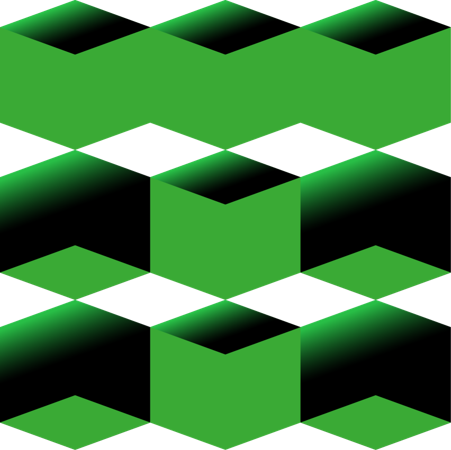

<style>
section {
  font-family: 'Roboto', 'Segoe UI', 'Liberation Sans', 'Helvetica', 'Arial', sans-serif !important;
  font-size: 1.55rem;
  padding: 3.5rem;
  justify-content: start;
}
</style>


<p align="center">
  
</p>


<center>

<br>

# Системный анализ процессов переработки нефти и газа

## Лекция №2 <br> Структуры данных: словари и множества. <br> Функции в Python


<br>
Вячеслав Алексеевич Чузлов

к.т.н., доцент ОХИ ИШПР ТПУ 


---

<!-- paginate: true -->


<style scoped>
  section {
    justify-content: center;
    font-size: 40px;
  }
</style>


# Словари (dict)


<!-- _paginate: skip -->

---

# Словари (dict)

- В Python словарь – это тип «ассоциативного массива», представляющего набор пар ключ-значение (key-value).
- Словарь может содержать любые объекты как значения (values), но, в отличие от списков и кортежей, каждый элемент в словаре индексируется уникальным ключом (key), который может быть любым **неизменяемым** объектом.
- Словари являются <mark>изменяемыми</mark> объектами.

Словарь можно определить с помощью пар `key:value`, записанных в фигурных скобках:

```python
height = {
    'Burj Khalifa': 828., 
    'One World Trade Center': 541.3,
    'Mercury City Tower': '', 
    'Q1': 323.,
    'Carlton Centre': 223., 
    'Gran Torre Santiago': 300.,
    'Mercury City Tower': 339.
}
```

---

# Определение и индексирование словаря

- Отдельный элемент можно извлечь по его ключу, применяемому в качестве индекса, или с помощью переменной, значение которой равно ключу:

```python
print(height['One World Trade Center'])  # 541.3
building = 'Carlton Centre'
print(height[building])  # 223.0
```
<br>

- Элементы (значения) в словаре также можно присваивать по индексу

```python
height['Empire State Building'] = 381.  # добавление нового элемента присваиванием по ключу
height['The Shard'] = 306.
```
---

# Определение и индексирование словаря

- Передача последовательности пар (*ключ*, *значение*) в конструктор `dict()`. 

```python
ordinal = dict([(1, 'First'), (2, 'Second'), (3, 'Third')])
print(ordinal[2])  # обратите внимание: здесь 2 - ключ, а не индекс
# Second
```
- Если ключи - простые строки (которые могут использоваться как имена переменных), то пары можно определять как именованные аргументы для конструктора `dict()`:

```python
mass = dict(Mercury=3.301e23, Venus=4.867e24, Earth=5.972e24)
print(mass['Earth'])  # 5.972e24
```
Итеративный проход в цикле `for` по словарю возвращает ключи (в порядке вставки ключей):

```python
for c in ordinal:
    print(c, ordinal[c])

# 1 First
# 2 Second
# 3 Third
```

---

# Определение и индексирование словаря

Простой словарь римских цифр:

```python
numerals = {
    'one':'I', 'two':'II', 'three':'III', 'four':'IV', 'five':'V',
    'six':'VI', 'seven':'VII', 'eight':'VIII',
    1: 'I', 2: 'II', 3: 'III', 4:'IV', 5: 'V', 6:'VI', 7:'VII', 8:'VIII'
}
for num in ['three', 'four', 'five', 'six']:
    print(numerals[num], end = ' ')  # III IV V VI

for i in range(8, 0, -1):
    print(numerals[i], end=' ')  # VIII VII VI V IV III II I
```

> - Словарь можно проиндексировать в любом порядке, независимо от порядка, в котором сохраняются ключи.
> - Ключи словаря обязательно должны быть **неповторяющимися**, однако на значения это ограничение не распространяется.

---


<style scoped>
  section {
    justify-content: center;
    font-size: 40px;
  }
  h1 {
    /* color: white; */
    padding: 0px 0px 0px 0px;
    height: auto;
    align: justify; 
  }
</style>


   


<h1>Методы словарей</h1>


<!-- # Методы словарей -->


<!-- _paginate: skip -->

---

# Метод `get()`

> Обращение к словарю по индексу с несуществующим ключом приводит к <mark>ошибке</mark>:

```python
print(mass['Pluto'])  # KeyError: 'Pluto'
```

- Можно использовать метод `get()` для извлечения значения, задавая ключ, если он существует, или некоторое значение по умолчанию, если ключ не существует. 
- Если значение по умолчанию не задано, то возвращается специальное значение `None`.

```python
print(mass.get('Pluto'))  # None
print(mass.get('Pluto', -1))  # -1
```

---

# Методы `kyes()`, `values()` и `items()`

- Методы `keys()`, `values()` и `items()` возвращают соответственно ключи, значения и пары ключ-значение (в виде кортежей) словаря.

```python
planets = mass.keys()
print(planets)  # dict_keys(['Mercury', 'Venus', 'Earth'])
for planet in planets:
    print(planet , mass[planet])

# Mercury 3.301e+23
# Venus 4.867e+24
# Earth 5.972e+24
```

> По объекту `dict_keys` можно выполнять итеративный проход любое число раз, но **невозможно** индексировать и **нельзя** выполнять операции присваивания:

```python
planets = mass.keys()
print(planets[0])  # TypeError: 'dict_keys' object is not subscriptable
```

---

# Методы `kyes()`, `values()` и `items()`

- Методы `values()` и `items()` аналогичным образом извлекают значения и элементы (пары ключ-значение) и возвращают объекты `dict_values` и `dict_items`:

<br>

```python
print(mass.values())  # dict_values ([3.301e+23, 4.867e+24, 5.972e+24])
print(mass.items())  # dict_items([('Mercury', 3.301e+23), ('Venus', 4.867e+24), ('Earth', 5.972e+24)])

for planet_data in mass.items():
    print(palnet_data)

# ('Mercury', 3.301e+23)
# ('Venus', 4.867e+24)
# ('Earth', 5.972e+24)
```

---

# Инициализация словарей

- Объединение его ключей и значений при помощи функции `zip()` с последующей передачей результата вызову `dict()`:

```python
lst1 = ['a', 'b', 'c', 'd']
lst2 = [5, 7, 9, 10, 15]  # значение 15 будет пропущено
print(zip(lst1, lst2))  # <zip object at 0x0000021751A13D80>
print(list(zip(lst1, lst2)))  # [('a', 5), ('b', 7), ('c', 9), ('d', 10)]

keys_and_values = list(zip(['a', 'b', 'c'], [1, 2, 3]))  # Упаковка ключей и значений
print(keys_and_values)  # [('a', 1), ('b', 2), ('c', 3)]

d = dict(zip(['a', 'b', 'c'], [1, 2, 3]))
print(d)  # {'a': 1, 'b': 2, 'c': 3}
```

---

# Генераторы словарей (dict comprehension)

- Генераторы словарей выполняют подразумеваемый цикл, накапливая на каждом шаге результаты «ключ: значение» и используя их для заполнения нового словаря:

```py
d = {k: v for k, v in zip(['a', 'b', 'c'], [1, 2, 3])}
print(d)  # {'a': 1, 'b': 2, 'c': 3}

d = {x: x ** 2 for x in [1, 2, 3, 4, 5]}
print(d)  # {1: 1, 2: 4, 3: 9, 4: 16, 5: 25}

d = {c: c * 5 for c in 'hello'}
print(d)  # {'h': 'hhhhh', 'e': 'eeeee', 'l': 'lllll', 'o': 'ooooo'}

fruits = {fruit.upper(): fruit + '!' for fruit in ['banana', 'orange', 'apple']}
print(fruits)  # {'BANANA': 'banana!', 'ORANGE': 'orange!', 'APPLE': 'apple!'}
```

---

# Генераторы словарей (dict comprehension)

- Генераторы словарей также удобно использовать при инициализации словарей из списка ключей, во многом подобно тому, как это можно реализовать при помощи метода `fromkeys()`:

```py
d = dict.fromkeys(['a', 'b', 'c', 'd'], ‐1) # Инициализация из ключей и значения ‐1
print(d)  # {'a': ‐1, 'b': ‐1, 'c': ‐1, 'd': ‐1}

d = {key: ‐1 for key in ['a', 'b', 'c', 'd']}
print(d)  # {'a': ‐1, 'b': ‐1, 'c': ‐1, 'd': ‐1}

d = dict.fromkeys('hello')  # Другой итерируемый объект и значение по умолчанию
print(d)  # {'h': None, 'e': None, 'l': None, 'o': None}

d = {key: None for key in 'hello'}
print(d)  # {'h': None, 'e': None, 'l': None, 'o': None}
```

---

<style scoped>
  section {
    justify-content: center;
    font-size: 40px;
  }
  h1 {
    /* color: white; */
    padding: 0px 0px 0px 0px;
    height: auto;
    align: justify; 
  }
</style>


   


# Множества (set)


<!-- _paginate: skip -->

---

# Множества (set)

- <span style="color: #ffb600;">**Множество**</span> представляет собой неупорядоченную коллекцию **уникальных** элементов, являющихся <mark>**неизменяемыми**</mark> объектами.
- Элемент встречается во множестве только один раз, в независимости от того, сколько раз он был добавлен.
- Поскольку множества представляют собой коллекции других элементов, они разделяют некоторые свойства и поведение с такими типами, как **списки** и **словари**. Например, множества являются **итерируемыми объектами**, их можно увеличивать и уменьшать по требованию, в них можно добавлять объекты других типов.
- Множества не сохраняют порядок следования элементов и не отображают ключи на значения.
- Множества являются <span style="color: #ffb600;">**изменяемыми объектами**</span> и не могут быть вложенны в другие множества.

---

# Создание объектов множеств

- Для создания объекта множества можно вызвать функцию `set()` и передать ей любой тип последовательности или другой итерируемый объект.
- В качестве результата будет получен объект множества, содержащий все элементы из переданного объекта (порядок элементов может варьироваться):

```py
x = set('hello')
print(x)  # {'l', 'h', 'e', 'o'}
```

- Для создания объектов множеств можно также использовать форму литералов множеств, применяя фигурные скобки `{}`. Следующие операторы эквивалентны:

```py
s = set([10, 20, 30, 40, 50])
print(s)  # {40, 10, 50, 20, 30}

s = {10, 20, 30, 40, 50}
print(s)  # {40, 10, 50, 20, 30}
```

---

# Создание объектов множеств

- Множества по сути похожи на <span style="color: #ffb600;">**словари без значений**</span>, т.к. элементы множеств не сохраняют порядок и в целом ведут себя похоже на ключи словаря.
- Обратите внимание на то, что пустые фигурные скобки `{}` – это операция, создающая пустой словарь.
- Пустые множества должны создаваться при помощи встроенной функции `set()`:

```py
s = {10, 20, 30, 40}

print(s - {10, 20, 30, 40})  # set()

# {} ‐ это пустой словарь
print(type({}))  # <class 'dict'>

s = set()  # Создание пустого множества
s.add(100)
print(s)  # {100}
```

---

# Операции и методы множеств


|Метод / операция|Описание|
|:-:|:-|
|`s1.union(s2)` <br> `s1 \| s2`|Возвращает множество, являющееся объединением множеств `s1` и `s2`|
|`s1.update(s2)` <br> `s1 \|= s2`|Добавляет в множество `s1` все элементы из множества `s2`|
|`s1.intersection(s2)` <br> `s1 & s2`|Возвращает множество элементов, которые есть во множествах `s1` и `s2`|
|`s1.intersection_update(s2)` <br> `s1 &= s2`|Оставляет в множестве `s1` только те элементы, которые есть во множестве `s2`|
|`s1.difference(s2)` <br> `s1 - s2`|Возвращает разность множеств `s1` и `s2` (элементы, входящие в `s1`, но не входящие в `s2`)|

---

# Операции и методы множеств

|Метод / операция|Описание|
|:-:|:-|
|`s1.difference_update(s2)` <br> `s1 -= s2`|Удаляет из множества `s1` все элементы, входящие в `s2`|
|`s1.symmetric_difference(s2)` <br> `s1 ^ s2`|Возвращает симметрическую разность множеств `s1` и `s2` (элементы, входящие в `s1` или в `s2`, но не в оба из них одновременно)|
|`s1.symmetric_difference_update(s2)` <br> `s1 ^= s2`|Записывает в `s1` симметрическую разность множеств `s1` и `s2`|
|`s1.issubset(s2)` <br> `s1 <= s2`|Возвращает `True`, если `s1` является подмножеством `s2`|
|`s1.issuperset(s2)` <br> `s2 >= s2`|Возвращает `True`, если `s2` является подмножеством `s1`|


---

# Генераторы множеств

- Выражение генератора множеств по форме похоже на выражение генератора списков, однако записывается в фигурных, а не квадратных скобках.
- Генераторы множеств запускают цикл и на каждой его итерации накапливают результат выражения. Результатом является новый объект множества.

```py
s = {x ** 2 for x in [10, 20, 30, 40, 50]}
print(s)  # {1600, 900, 2500, 100, 400}
```

- Генераторы множеств могут также выполнять проход по объектам других типов, таких, как строки:

```py
s = {x for x in 'hello'}
print(s)  # {'l', 'h', 'e', 'o'}

s = {c * 5 for c in 'SPAM!'}
print(s)  # {'!!!!!', 'SSSSS', 'AAAAA', 'MMMMM', 'PPPPP'}
```

---

# Примеры использования множеств

- Фильтрация дубликатов в коллекциях:

```py
a = [1, 2, 2, 3, 5, 4, 1, 1, 2, 5, 4]
a = list(set(a))
print(a)  # [1, 2, 3, 4, 5]
a = list(set(['hh', 'ee', 'll', 'll', 'oo'])) # Порядок не сохраняется
print(a)  # ['oo', 'hh', 'll', 'ee']
```

- Нахождение различий в списках, строках и прочих итерируемых объектах:

```py
a = [1, 2, 3, 4, 5, 7]
a2 = [1, 2, 4, 5, 6]
dif = set(a) ‐ set(a2)  # Различия в списках
print(dif)  # {3, 7}
s1 = 'spam'
s2 = 'ham'
dif = set(s1) ‐ set(s2)  # Различия в строках
print(dif)  # {'s', 'p'}
dif = set('tomato') ‐ set(['p', 'o', 't', 'a', 't', 'o'])  # Объекты разных типов
print(dif)  # {'m'}
```

---

# Примеры использования множеств

- Множества также можно применить для проверок на **равенство, нейтральное к порядку**.
- Два множества равны только в том случае, когда каждый элемент одного множества содержится в другом, иначе говоря, одно множество является подмножеством другого.
- К примеру, такой прием можно использовать для сравнения выводов программ, которые должны работать одинаковым образом, но могут генерировать результаты в разном порядке:

```py
a1, a2 = [1, 2, 3, 5, 4, 6], [2, 5, 3, 4, 1, 6]
# Порядок следования имеет значение
print(a1 == a2)  # False

# Проверка, нейтральная к порядку элементов
print(set(a1) == set(a2))  # True

print('hello' == 'olleh')  # False
print(set('hello') == set('olleh'))  # True
```

---

# Примеры использования множеств

- Множества удобны при работе с большими данными, например, запросами к базе данных.
- **Пересечение** множеств содержит общие элементы этих множеств, а **объединение** – все элементы множеств.

```py
engineers = {'Petr', 'Ivan', 'Fedor', 'Anna', 'Victoriya'}
managers = {'Petr', 'Anna', 'Boris'}
# Является ли сотрудник инженером?
print('Fedor' in engineers)  # True
# Кто одновременно инженер и менеджер?
print(engineers & managers)  # {'Anna', 'Petr'}
# Все сотрудники из двух категорий
print(engineers | managers)  # {'Anna', 'Boris', 'Fedor', 'Petr', 'Ivan', 'Victoriya'}
# Инженеры, не являющиеся менеджерами
print(engineers ‐ managers)  # {'Ivan', 'Fedor', 'Victoriya'}
# Все ли инженеры ‐ менеджеры?
print(engineers >= managers)  # False
# Оба ли сотрудника инженеры?
print({'Fedor', 'Anna'} <= engineers)  # True
# Кто находится только в одной категории?
print(managers ^ engineers)  # {'Boris', 'Fedor', 'Ivan', 'Victoriya'}
```

---

<style scoped>
  section {
    justify-content: center;
    font-size: 30px
  }
</style>


# Функции

<!-- _paginate: skip -->


---


<!-- paginate: true -->


# Описание функций

- <span style="color: #ffb600;">**Функции**</span> – это многократно используемые фрагменты программы. Они позволяют дать имя определенному блоку команд с тем, чтобы в последствии запускать блок по указанному имени в любом месте программы и сколь угодно много раз. Это называется **вызовом функции**.
- Функции определяются при помощи зарезервированного слова `def`. После этого слова указывается имя функции, за которым следует пара скобок, в которых можно указать имена некоторых переменных, и заключительное двоеточие в конце строки. Далее следует блок команд (инструкций), составляющих тело функции.
- <span style="color: #ffb600;">**Сигнатура функции**</span> – часть общего объявления функции, позволяющая средствами трансляции идентифицировать функцию среди других. Составляющие сигнатуры:

<div class="columns">
<div>

1. имя функции;
2. аргументы функции;
3. возвращаемые значения.

</div>

<div>

```py
def say_hi():
    print('Hi!)


say_hi()  # Hi!
```

</div>

</div>


---

# Оператор `def`

- Оператор `def` создает объект функции и присваивает его имени.
- Общий формат оператора `def` выглядит следующим образом:

```py
def function_name(arg1, arg2, ..., argN):
    operator1  # операторы могут отсутствовать
    operator2
    ...
    operatorN
    return  # может быть пропущен
```

- В строке заголовка `def` указывается имя функции, которому присваивается объект функции, а также список из нуля и более аргументов (иногда называемых параметрами) в круглых скобках.
- Именам аргументов в заголовке присваиваются объекты, передаваемые в круглых скобках
при вызове функции.

---

# Оператор `return`

- Тело функции почти всегда содержит оператор `return`:

```py
def function_name(arg1, arg2, ..., arg3):
    operators
    ...
    return ...
```

- Оператор `return` в Python может появляться где угодно в теле функции; по достижении он заканчивает выполнение функции и возвращает результат обратно вызывающему коду.
- Оператор `return` состоит из необязательного выражения с объектным значением, которое дает результат функции. Если значение опущено, тогда `return` возвращает `None`.
- Оператор `return` сам по себе также необязателен; если он отсутствует, то выход из функции происходит, когда интерпретатор достигает конца тела функции. Формально функция без оператора `return` автоматически возвращает объект `None`.
- Хорошим тоном является явное использование пустого оператора `return` для дополнительного пояснения того, что функция ничего не возвращает.

---

# Оператор `return`

- Оператор `return` используется для возврата из функции, т.е. для прекращения её работы и выхода из неё. При этом можно также вернуть некоторое значение из функции.
- Оператор `return` в Python может появляться где угодно в теле функции; по достижении он заканчивает выполнение функции и возвращает результат обратно вызывающему коду.

<div class="columns">

<div>

```py
def maximum(x, y):
    if x > y:
        return x
    
    elif x == y:
        return 'Equals'
    
    else:
        return y


print(maximum(20, 30))  # 30
```

</div>

<div>

```py
def maximum(x, y):
    if x > y:
        return x
    
    if x == y:
        return 'Equals'
    
    return y


print(maximum(20, 30))  # 30
```

</div>

</div>

---

# Параметры функций

- Функции могут принимать параметры, т.е. некоторые значения, передаваемые функции для того, чтобы она что-либо сделала с ними.
- Параметры указываются в скобках при объявлении функции и разделяются запятыми. Аналогично мы передаём значения, когда вызываем функцию.
- Обратите внимание на терминологию: имена, указанные в объявлении функции, называются <span style="color: #ffb600;">**параметрами**</span>, тогда как значения, которые будут переданы функции при её вызове – <span style="color: #ffb600;">**аргументами**</span>.

---

# Примеры определения и вызова функций

Ниже показано <span style="color: #ffb600;">**определение**</span> функции по имени `times`, которая возвращает произведение двух аргументов:

```py
def times(x, y):
    return x * y
```

- Когда интерпретатор встречает и выполняет этот оператор `def`, он создает новый объект функции, умещающий в себе код функции, и присваивает его имени `times`.
- Обычно такой оператор находится в файле модуля и выполняется при его импортировании.

---

# Примеры определения и вызова функций

- Оператор `def` создает функцию, но не вызывает ее.
- После выполнения `def` функцию можно <span style="color: #ffb600;">**вызывать**</span> (выполнить) в своей программе, добавляя к имени функции круглые скобки.
- Круглые скобки могут дополнительно содержать один и более объектов-аргументов, подлежащих передаче (присваиванию) именам в заголовке функции.
  
```py
print(times(3, 5))  # 15
print(times('abc', 2))  # abcabc
```

- Выражение вызова передает в `times` два аргумента. Аргументы передаются по порядку следования.
- Возвращаемый объект можно присвоить переменной:

```py
x = times(3.14, 3)
print(x)  # 9.42
```

---

# Примеры определения и вызова функций

```py
def print_max(a, b):
    if a == b:
        print(f'{a} equals to {b}')
    else:
        m = a if a > b else b
        print(f'{m} is max)


print_max(6, 7)  # 7 is max
print_max(3, 3)  # 3 equals to 3

x, y = 5, 2
print_max(x, y)  # 5 is max
```

---

<style scoped>
  section {
    justify-content: center;
    font-size: 30px
  }
</style>


# Области видимости

<!-- _paginate: skip -->


---

# Локальные переменные

- При объявлении переменных внутри определения функции, они никоим образом не связаны с другими переменными с таким же именем за пределами функции – т.е. имена переменных являются локальными в функции.
- Это называется <span style="color: #ffb600;">**областью видимости переменной**</span>. Область видимости всех переменных ограничена блоком, в котором они объявлены, начиная с точки объявления имени.

```py
x = 50


def func(x):
    print(f'x = {x}')  # x = 50
    x = 2
    print(f'Replace x to {x}')  # Replace x to 2


func(x)
print(f'x = {x}')  # x = 50
```

---

# Области видимости и вложенные функции

Рассмотрим пример вложенной области видимости:

```py
x = 24  # Имя в глобальной области видимости

def func1():
    x = 55  # Локальное имя объемлющего def

    def func2():
        print(x)  # Ссылка во вложенном def
    
    func2()

func1()  # Выводит 55: локальное имя объемлющего def
```

- Здесь вложенный оператор `def` запускается, пока выполняется функция `func1()`; он создает объект функции и присваивает его имени `func2()`, т.е. локальной переменной внутри локальной области видимости `func1()`.
- `func2()` представляет собой временную функцию, которая существует только в период выполнения (и видима только в коде) объемлющей функции `func1()`.

---

# Области видимости и вложенные функции

- Поиск в объемлющей области видимости работает, даже если уже произошел возврат из объемлющей функции.

```py
def func1():
    x = 44

    def func2():
        print(x)  # Помнит значение x из области видимости объемлющего def
    
    return func2  # Возвращает объект функции func2, но не вызывает ее

action = func1()  # Создает и возвращает объект функции
action()  # Вызов функции: выводит 44
```

- Функции в Python могут передаваться как возвращаемые значения.
- Вызов `action()` вызывает функцию `func2()`, созданную во время выполнения `func1()`.
- Функция `func2()` помнит значение `x` из объемлющей области видимости функции `func1()`, хотя `func1()` больше неактивна.


---

# Замыкания

- <span style="color: #ffb600;">**Замыкание**</span> – это методика **функционального программирования**, идея которой заключается в запоминании значений из объемлющих областей видимости, невзирая на то, присутствуют ли еще эти области видимости в памяти.

```py
def maker(n):
    
    def action(x):
        return x ** n  # action сохраняет значение n
    
    return action
```

- Функция `maker()` создает `action()`, и возвращает `action()` без выполнения.
- Если вызвать внешнюю функцию – будет получена ссылка на вложенную функцию:
```py
f = maker(3)
print(f)  # <function maker.<locals>.action at 0x000001987C301160>
```

---

# Замыкания

- Вызов результата, возвращенного внешней функцией приводит к запуску вложенной функции, названной `action()` внутри `maker()`:
```py
# Передача 5 аргументу x, в n запоминается 3: 5 ** 3
print(f(5))  # 125
# 2 ** 3
print(f(2))  # 8
```
- Если снова вызвать внешнюю функцию, то получим новую вложенную функцию с другой информацией о состоянии. Каждый вызов замыкания получает собственный набор информации о состоянии. Функция `g` запоминает $2$, a `f` запоминает $3$:
```py
g = maker(2)
print(g(5))  # 25
print(f(5))  # 125
```

---

<style scoped>
  section {
    justify-content: center;
    font-size: 30px
  }
</style>


# Аннотация типов <br> (type hints)

<!-- _paginate: skip -->

---

# Аннотация типов (type hints)

<span style="color: #ffb600;">**Аннотоация типов**</span> - это подсказки типов данных в Python, которые помогают разработчикам лучше понимать и контролировать типы данных, используемые в коде. 

> Вместо того, чтобы полагаться на динамическую типизацию, где типы данных определяются автоматически во время выполнения, Вы можете явно указать типы данных переменных, функций и классов, используя _type hints_.

#### Перимущества использования аннотации типов

- Улучшение читаемости кода: Явное указание типов данных делает код более понятным для других разработчиков.
- Помощь в обнаружении ошибок: _Type hints_ позволяют инструментам статического анализа кода (например, mypy, Pyright) проверять код на наличие ошибок типов данных.
- Улучшение автодополнения кода: Интегрированные среды разработки могут использовать *type hints* для предоставления более точных предложений автодополнения кода.

---

# Аннотация типов (type hints)

- Для указания типа переменной используйте двоеточие и тип данных:
```py
name: str = 'John'
age: int = 25
```
- Для указания типов аргументов функции также используется `:`, для возвращаемого значения используйте `->`:
```py
def greet(name: str) -> str:
    return 'Hello, ' + name
```
- Для указания типов атрибутов класса используйте аннотации типов и метод `__init__()`:
```py
class Person:
    def __init__(self, name: str, age: int) -> None:
        self.name: str = name
        self.age: int = age
        return
```

---

# Строки документации (docstring)

<!--  -->

```py
def calculate_flow_density(x: list[float], d: list[float]) -> float:
    """
    Calculates density of material flow

    Parameters
    ----------
    x : list[float]
        A list of components mass fractions.
    d : list[float]
        A list of components densities in kg/m^3.

    Returns
    -------
    float
        Flow density [kg/m^3].

    """
    density = 0

    for i in range(len(x)):
        density += x[i] / d[i]
    
    return density ** -1
```

---

<style scoped>
  section {
    justify-content: center;
    font-size: 30px
  }
</style>


# Синтаксис передачи аргументов

<!-- _paginate: skip -->

---

# Формы передачи аргументов функции

Формы передачи аргументов в определении функций.

|Синтаксис|Интерпретация|
|-|-|
|`func(значение)`|Позиционный аргумент: передается по позиции|
|`func(имя=значение)`|Ключевой (именованный) аргумент: передается по имени|
|`func(*итерируемый_объект)`|Передает все объекты в *итерируемом объекте* как отдельные позиционные аргументы|
|`func(**словарь)`|Передает все пары ключ/значение в словаре как отдельные именованные аргументы|


---

# Формы передачи аргументов функции

Формы передачи аргументов при вызове функций.

|<div style="width:290px">Синтаксис</div>|Интерпретация|
|-|-|
|`def func(имя)`|Позиционный аргумент: сопоставляется с любым переданным значением по позиции или по имени|
|`def func(имя=значение)`|Стандартное значение аргумента, если значение в вызове не передавалось|
|`def func(*имя)`|Передает и собирает оставшиеся позиционные аргументы в кортеж|
|`def func(**имя)`|Передает и собирает оставшиеся ключевые аргументы в словарь|

---

# Формы передачи аргументов функции

Формы передачи аргументов при вызове функций.

|<div style="width:520px">Синтаксис</div>|Интерпретация|
|-|-|
|`def func(*параметры, имя1, имя2, ... имяN)`|Неограниченная передача позиционных аргументов; обязательная передача всех именованных аргументов по ключевому слову|
|`def func(*, имя1, имя2, ... имяN)`|Запрет позиционных аргументов; обязательная передача всех именованных аргументов по ключевому слову|
|`def func(имя1, имя2, ..., /)`|Запрет именованных аргументов|

---

# Позиционные аргументы

- Если не использовать какой-то специальный синтаксис сопоставления, то Python будет сопоставлять имена по позиции слева направо подобно большинству других языков.
Например, если Вы определили функцию, которая требует трех аргументов, тогда должны
вызывать ее с тремя аргументами:

```py
def f(x: int, y: int, z: int) -> tuple[int]:
    return x, y, z


print(f(0, 1, 2))  # (0, 1, 2)
```

- Здесь аргументы передаются по позиции – `x` соответствует `0`, `y` – `1` и `z` – `2`.

---

# Именованные параметры

- <span style="color: #ffb600;">**Именованные аргументы**</span> делают возможным сопоставление по имени, а не по позиции.

```py
print(f(z=2, x=0, y=1))  # (0, 1, 2)
```

- Здесь `z=2` означает передачу значения `2` аргументу по имени `z`. Когда применяются ключевые слова, порядок следования аргументов несущественен.
- Разрешено комбинировать позиционные и ключевые аргументы. Сначала сопоставляются позиционные аргументы слева направо в заголовке, а затем ключевые аргументы по имени:

```py
print(f(0, z=2, y=1))  # (0, 1, 2)
```

- Ключевые аргументы делают вызовы функций самодокументированными. Вызов функции:
```py
func(name='James', age=20, job='student')
```

выглядит более значащим по сравнению с вызовом, содержащим три разделенных запятыми значения, особенно в крупных программах.

---

# Значения по умолчанию

- Стандартные значения позволяют делать некоторые аргументы функции необязательными. Если значение для аргумента не было передано, то используется стандартное значение.

```py
# Аргумент x обязательный, y и z необязательные
def f(x: int, y: int = 1, z: int = 2) -> tuple[int]: 
    return x, y, z  
```

- При вызове такой функции обязательно нужно предоставить значение для `x`, либо по позиции, либо по имени; однако передача значений для `y` и `z` необязательна:

```py
print(f(0))  # (0, 1, 2)
print(f(x=0))  # (0, 1, 2)
```

- В случае передачи двух значений стандартное значение получит только аргумент `z`, а при передаче трех значений стандартные значения вообще не применяются:

```py
print(f(10, 20))  # (10, 20, 2)
print(f(10, 20, 30))  # (10, 20, 30)
```

---

# Заголовки функций: сбор аргументов

- Расширения при передаче аргументов `*` и `**` предназначены для поддержки функций, принимающих <span style="color: #ffb600;">**любое количество**</span> аргументов.
- Когда расширение `*` применяется в определении функции, оно обеспечивает сбор неограниченного количества позиционных аргументов в кортеж:

```py
def f(*args) -> tuple:
    return args
```

- Python собирает все позиционные аргументы в кортеж и присваивает его переменной `args`. Поскольку это кортеж, допускается индексация, проход в цикле `for` и т.д.:

```py
print(f())  # ()
print(f(10))  # (10,)
print(f(10, 20, 30))  # (10, 20, 30)
```

---

# Заголовки функций: сбор аргументов

- Расширение `**` работает с ключевыми аргументами – оно собирает их в словарь, который
затем можно обрабатывать с помощью инструментов для словарей:

```py
def f(**kwargs) -> dict:
    return kwargs

print(f())  # {}
print(f(x=2, y=3))  # {'x': 2, 'y': 3}
```

- В заголовках функций можно комбинировать позиционные аргументы с расширениями `**` и `*`, чтобы реализовывать гибкие сигнатуры вызовов.

```py
def f(x: int, *args, **kwargs) -> tuple[int, tuple, dict]:
    return x, args, kwargs

print(f(1, 2, 3, a=10, b=20))  # (1, (2, 3), {'a': 10, 'b': 20})
```

- Подобный код может встречаться в функциях, которым необходимо поддерживать множество шаблонов вызова.

---

# Вызовы функций: распаковка аргументов

- Синтаксис `*` в контексте вызова функции имеет смысл, противоположный его смыслу в
определении функции – он распаковывает коллекцию аргументов, а не собирает ее.

```py
def f(a: int, b: float, c: int, d: str) -> tuple:
      return a, b, c, d

args = 10, 1.5, 2, 'is good'

print(f(*args))  # (10, 1.5, 2, 'is good')
```

- Подобным образом синтаксис `**` в вызове функции распаковывает словарь пар ключ:значение в отдельные именованные аргументы.

```py
params = {'a': 15, 'b': 2.36, 'c': 25, 'd': ''}
print(f(**params))  # (15, 2.36, 25, '')
```

---

# Вызовы функций: распаковка аргументов

- Разрешено комбинировать позиционные и ключевые аргументы очень гибкими способами:

```py
def f(a: int, b: int, c: int, d: int) -> tuple:
    return a, b, c, d


print(f(10, 20, **{'d': 40, 'c': 30}))  # (10, 20, 30, 40)
print(f(*(10, 20), **{'d': 40, 'c': 30}))  # (10, 20, 30, 40)
print(f(10, *(20, 30), **{'d': 40}))  # (10, 20, 30, 40)
print(f(10, c=30, *(2, ), **{'d': 40}))  #  (10, 2, 30, 40)
print(f(10, *(20, 30), d=40))  # (10, 20, 30, 40)
print(f(10, *(20, ), c=30, **{'d': 40}))  # (10, 20, 30, 40)
```

---

<style scoped>
  section {
    justify-content: center;
    font-size: 30px
  }
</style>


# Анонимные (`lambda`) функции

<!-- _paginate: skip -->

---

# Анонимные (`lambda`) функции

- Помимо инструкции `def` в языке Python имеется возможность создавать объекты функций в форме выражений.
- Подобно инструкции `def` это выражение создает функцию, которая будет вызвана позднее, но в отличие от инструкции `def`, выражение возвращает функцию, а не связывает ее с именем.
- Именно поэтому `lambda`-выражения иногда называют анонимными (т.е. безымянными) функциями.
- На практике они часто используются как способ получить встроенную функцию или отложить выполнение фрагмента программного кода.
- Общая форма `lambda`-функций выглядит как ключевое слово `lambda`, за которым следует один или больше аргументов (очень похоже на список аргументов, заключенный в круглые скобки в заголовке `def`) и далее выражение после двоеточия:
```py
lambda arg1, arg2, ..., argN: expression
```

---

# Анонимные (`lambda`) функции

- Тело `lambda` является одиночным выражением, а не блоком операторов и похоже на то, что
было бы указано в операторе return внутри тела `def`.
- Из-за ограничения только выражением, тело `lambda` менее универсально, чем `def` – можно
помещать в тело `lambda` лишь определенную логику, не использующую операторы вроде `if`.
- Так было задумано, чтобы ограничить вложенность в программе: выражение `lambda` предназначено для записи простых функций, а оператор `def` можно использовать для решения более крупных задач.

<div class="columns">

<div>

```py
def f(x: int, y: int) -> int:
    return x + y

print(f(1, 2))  # 3
```

</div>

<div>

```py
f = lambda x, y: x + y
print(f(1, 2))  # 3


```

</div>

</div>


---

# Использование `lambda`-выражений

- Выражение `lambda` полезно как своего рода краткое условное обозначение функции,
которое позволяет встраивать определение функции внутрь кода, где оно применяется.

- В сценариях, где нужно всего лишь встраивать небольшие порции кода, выражения `lambda`
окажутся более простыми кодовыми конструкциями, чем операторы `def`.

```py
from random import randint

x = [randint(-5, 5) for _ in range(10)]
print(x)  # [‐4, ‐2, ‐4, 2, ‐5, 0, ‐4, 4, ‐5, ‐3]

print(min(x, key=lambda x: x ** 2 - 9 * x + 5))  # 4
```

- Фактически, поиск минимума происходил в этом списке:

```py
print([num ** 2 - 9 * num + 5 for num in x])  # [57, 27, 57, ‐9, 75, 5, 57, ‐15, 75, 41]
```

но результат – соответсвующий элемент из списка `x`.

---

# Использование `lambda`-выражений

- Выражения `lambda` широко используются при реализации таблиц переходов, которые представляют собой списки или словари действий, подлежащих выполнению по запросу.

```py
function_list = [
    lambda x: x ** 2,
    lambda x: x ** 3,
    lambda x: x ** 4
]

for f in function_list:
    print(f(3), end=' ')

print()
print(function_list[0](5))

# 9 27 81
# 25
```

---

# Использование `lambda`-выражений

- Эквивалентный код с `def` потребовал бы временных имен функций (возможны конфликты с остальными именами) и определений функций за пределами контекста их планируемого применения (который может находиться на сотни строк дальше):

```py
def f1(x: int) -> int:
    return x ** 2

def f2(x: int) -> int:
    return x ** 3

def f3(x: int) -> int:
    return x ** 4

function_list = [f1, f2, f3]
for f in function_list:
    print(f(3), end=' ')

print()
print(function_list[0](5))
# 9 27 81
# 25
```

---

# Использование `lambda`-выражений

- В действительности можно использовать словари и другие структуры данных в Python для построения более универсальных разновидностей таблиц действий:

```py
key = 'got'

actions = {
    'already': lambda: 2 + 2,
    'got': lambda: 5 * 5,
    'one': lambda: 2 ** 6,
}

print(actions[key]())  # 25
```

- Когда Python создает словарь `actions`, каждое вложенное выражение `lambda` генерирует функцию, подлежащую вызову в будущем.
- Индексация по ключу извлекает одну из функций, а круглые скобки приводят к вызову извлеченной функции.
- Таким образом, словарь становится инструментом для множественного ветвления.

---

<style scoped>
  section {
    justify-content: center;
    font-size: 30px
  }
</style>

.webp)

# Функции генераторы

<!-- _paginate: skip -->


---

# Функции-генераторы 

- <span style="color: #ffb600;">**Функция-генератор**</span> – это функция, которая может возвращать значение, а позднее продолжить свою работу с того места, где она была приостановлена.
- Такая функция генерирует последовательность значений с течением времени, а также автоматически поддерживает протокол итераций и может использоваться в контексте итераций.
- Функции-генераторы записываются как обычные операторы `def`, но в них применяются операторы `yield`, вместо операторов `return`.
- Функция-генератор возобновляет работу, ее выполнение продолжается с первой
инструкции, следующей после оператора `yield`. Это позволяет функциям воспроизводить последовательности значений в течение долгого времени, вместо того, чтобы создавать всю последовательность сразу и возвращать ее в виде некоторой конструкции, такой как список.


---

# Функции-генераторы 

- Определим функцию-генератор, которую можно применять для получения квадратов серии чисел с течением времени:

```py
def generate_squares(n):
    for x in range(n):
        yield x ** 2
```

- Функция `generate_squares` выдает значение и возвращает управление вызывающему коду на каждой итерации цикла; при возобновлении ее выполнения восстанавливается предыдущее состояние, включая последние значения переменных `x` и `n`, а управление снова подхватывается непосредственно после оператора `yield`.

```py
for i in generate_squares(5):
    print(i, end=' | ')

#  0 | 1 | 4 | 9 | 16 |
```

---

# Функции-генераторы 

- Возвращенный объект генератора имеет метод `__next__()`, который запускает функцию или возобновляет ее выполнение с места, откуда она последний раз выдала значение, и инициирует исключение `StopIteration`, когда достигнут конец серии значений.
- Встроенная функция `next()` вызывает метод `__next__()` итерируемого объекта:
```py
fg = generate_squares(5)
print(next(fg))  # 0
print(next(fg))  # 1
print(next(fg))  # 4
print(next(fg))  # 9
print(next(fg))  # 16
print(next(fg))  # StopIteration
```

- После использования итерации по генератору, он **останется пустым**. Для повторной итерации придется создать новый объект генератора.

---

<style scoped>
  section {
    justify-content: center;
    font-size: 30px;
    
  }
</style>

<!-- _paginate: skip -->


<br>

<center>

<!--  -->


<br>

# Благодарю за внимание!

<br>

Вячеслав Алексеевич Чузлов
к.т.н., доцент ОХИ ИШПР

</center>
