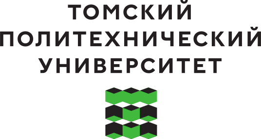
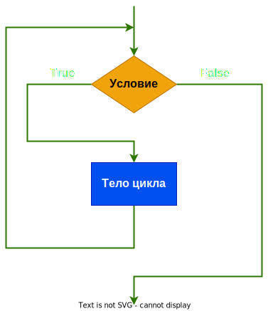

<style>
section {
  font-family: 'Roboto', 'Segoe UI', 'Liberation Sans', 'Helvetica', 'Arial', sans-serif !important;
  font-size: 1.55rem;
  padding: 3.5rem;
  justify-content: start;
}
</style>


<p align="center">
  
</p>


<center>

<br>

# Системный анализ процессов переработки нефти и газа

## Лекция №2 <br> Структуры данных: словари и множества. <br> Функции в Python


<br>
Вячеслав Алексеевич Чузлов

к.т.н., доцент ОХИ ИШПР ТПУ 


---

<!-- paginate: true -->


<style scoped>
  section {
    justify-content: center;
    font-size: 40px;
  }
</style>


# Словари (dict)


<!-- _paginate: skip -->

---

# Словари (dict)

- В Python словарь – это тип «ассоциативного массива», представляющего набор пар ключ-значение (key-value).
- Словарь может содержать любые объекты как значения (values), но, в отличие от списков и кортежей, каждый элемент в словаре индексируется уникальным ключом (key), который может быть любым **неизменяемым** объектом.
- Словари являются <mark>изменяемыми</mark> объектами.

Словарь можно определить с помощью пар `key:value`, записанных в фигурных скобках:

```python
height = {
    'Burj Khalifa': 828., 
    'One World Trade Center': 541.3,
    'Mercury City Tower': '', 
    'Q1': 323.,
    'Carlton Centre': 223., 
    'Gran Torre Santiago': 300.,
    'Mercury City Tower': 339.
}
```

---

# Определение и индексирование словаря

- Отдельный элемент можно извлечь по его ключу, применяемому в качестве индекса, или с помощью переменной, значение которой равно ключу:

```python
print(height['One World Trade Center'])  # 541.3
building = 'Carlton Centre'
print(height[building])  # 223.0
```
<br>

- Элементы (значения) в словаре также можно присваивать по индексу

```python
height['Empire State Building'] = 381.  # добавление нового элемента присваоиванием по ключу
height['The Shard'] = 306.
```
---

# Определение и индексирование словаря

- Передача последовательности пар (*ключ*, *значение*) в конструктор `dict()`. 

```python
ordinal = dict([(1, 'First'), (2, 'Second'), (3, 'Third')])
print(ordinal[2])  # обратите внимание: здесь 2 - ключ, а не индекс
# Second
```
- Если ключи - простые строки (которые могут использоваться как имена переменных), то пары можно определять как именованные аргументы для конструктора `dict()`:

```python
mass = dict(Mercury=3.301e23, Venus=4.867e24, Earth=5.972e24)
print(mass['Earth'])  # 5.972e24
```
Итеративный проход в цикле `for` по словарю возвращает ключи (в порядке вставки ключей):

```python
for c in ordinal:
    print(c, ordinal[c])

# 1 First
# 2 Second
# 3 Third
```

---

# Определение и индексирование словаря

Простой словарь римских цифр:

```python
numerals = {
    'one':'I', 'two':'II', 'three':'III', 'four':'IV', 'five':'V',
    'six':'VI', 'seven':'VII', 'eight':'VIII',
    1: 'I', 2: 'II', 3: 'III', 4:'IV', 5: 'V', 6:'VI', 7:'VII', 8:'VIII'
}
for num in ['three', 'four', 'five', 'six']:
    print(numerals[num], end = ' ')  # III IV V VI

for i in range(8, 0, -1):
    print(numerals[i], end=' ')  # VIII VII VI V IV III II I
```

> - Словарь можно проиндексировать в любом порядке, независимо от порядка, в котором сохраняются ключи.
> - Ключи словаря обязательно должны быть **неповторяющимися**, однако на значения это ограничение не распространяется.

---


<style scoped>
  section {
    justify-content: center;
    font-size: 40px;
  }
  h1 {
    /* color: white; */
    padding: 0px 0px 0px 0px;
    height: auto;
    align: justify; 
  }
</style>


<!-- <div id="rectangle"> </div> -->
    


<h1>Методы словарей</h1>


<!-- # Методы словарей -->


<!-- _paginate: skip -->

---

# Метод `get()`

> Обращение к словарю по индексу с несуществующим ключом приводит к <mark>ошибке</mark>:

```python
print(mass['Pluto'])  # KeyError: 'Pluto'
```

- Можно использовать метод `get()` для извлечения значения, задавая ключ, если он существует, или некоторое значение по умолчанию, если ключ не существует. 
- Если значение по умолчанию не задано, то возвращается специальное значение `None`.

```python
print(mass.get('Pluto'))  # None
print(mass.get('Pluto', -1))  # -1
```

---

# Методы `kyes()`, `values()` и `items()`

- Методы `keys()`, `values()` и `items()` возвращают соответственно ключи, значения и пары ключ-значение (в виде кортежей) словаря.

---

# Оператор присваивания

Для выполнения операции присванивания в Python используется оператор `=`:


```py
x = 10
y = 20
print(x + y)  # 30
```

> **Составные операторы присваивания** - набор операторов, сочитающих в себе бинарную операцию и оператор присваивания.


```py
x = 1
x = x + 10  # Традиционное присваивание
print(x)  # 11
x += 10  # Составное присваивание
print(x)  # 21
```

Составные операторы присваивания:
`x += y` `x -= y` `x /= y` `x //= y`  `x %= y` `x *= y` `x **= y` 

---

# Математические функции

- Две математические функции, предоставляемые «по умолчанию» как встроенные (built-in), – `abs()` и `round()`.

```python
print(abs(-5.2))  # 5.2
print(abs(-2))  # 2
print(abs(3 + 4j))  # 5.0
```
Это пример полиморфизма (polymorphism): одна и та же функция `abs()` выполняет различные операции с различными объектами:
- если в функцию передано действительное число `x`, то возвращается $\left|x\right|$, неотрицательная величина этого числа без учета знака. 
- если передается комплексное число $z = x + iy$, то возвращается его модуль <br> $\left|z\right| = \left(x^2 + y^2\right)$.

---

# Математические функции

Функция `round()` (с одним аргументом) округляет число с плавающей точкой до ближайшего **четного** целого числа:

```python
print(round(-9.62))  # -10
print(round(7.5))  # 8
print(round(4.5))  # 4
```

- Можно также задать количество точных разрядов после десятичной точки как второй аргумент, передаваемый в функцию `round()`:

```python
print(round(3.141592653589793, 3))  # 3.142
print(round(96485.33289, -2))  # 96500.0
```

> Многие полезные математические функции расположены в модуле `math`, который импортируется при помощи следующей инструкции: 

```python
import math
```

---

# Математические функции

- В модуль `math` включены операции для работы с числами с плавающей точкой и целыми числами.
- Функции вызываются с передачей одного числа (иногда нескольких чисел) внутри круглых скобок (числа принимаются как аргументы вызываемой функции). Например:


```python
import math


print(math.exp(-1.5))  # 0.22313016014842982
print(math.cos(0))  # 1.0
print(math.sqrt(16))  # 4.0
```

---

# Математические функции

Некоторые функции, предоставляемые модулем `math`:

<center>

|Функция|Расшифровка|Функция|Расшифровка|
|-|-|-|-|
|`math.sqrt(x)`|$\sqrt{x}$|`math.asin(x)`|$\arcsin(x)$|
|`math.exp(x)`|$e^x$|`math.acos(x)`|$\arccos(x)$|
|`math.log(x)`|$\ln x$|`math.atan(x)`|$\arctan(x)$|
|`math.log(x, b)`|$\log _b x$|`math.sinh(x)`|$\sinh(x)$|
|`math.log10(x)`|$\log _{10} x$|`math.cosh(x)`|$\cosh(x)$|
|`math.sin(x)`|$\sin\left(x\right)$|`math.tanh(x)`|$\tanh(x)$|
|`math.cos(x)`|$\cos\left(x\right)$|`math.asinh(x)`|$\mathrm{arcsinh}(x)$|
|`math.tan(x)`|$\tan\left(x\right)$|`math.acosh(x)`|$\mathrm{arccosh}(x)$

</center>

`math.pi` и `math.e` - предоставляют значения чисел $\pi$ и $e$, соответственно.

---

<style scoped>
  section {
    justify-content: center;
    font-size: 30px
  }
</style>


# Переменные (variables)

<!-- _paginate: skip -->

---

# Что такое перерменная

- При создании объекта, например типа `float`, в программе на Python для этого объекта выделяется память: в  компьютерной архитектуре место расположения данного фрагмента памяти называется адресом памяти (*address*). Адрес объекта можно узнать при помощи стандартной функции `id()`:

```python
print(id(24.5))  # 1974400231344
```

> Это число является ссылкой на конкретное место в памяти, соответствующее фрагменту памяти, выделенному для хранения объекта типа `float` со значением `24.5`.

- Имя переменной может быть присвоено любому объекту («связано» с любым объектом) и использоваться для идентификации этого объекта в дальнейших вычислениях. Например:

```python
a = 3
b = -0.5
print(a * b)  # -1.5
```

---

# Имена переменных

Несколько правил, определяющих формирование допустимых («правильных») имен переменных:

- в именах переменных учитывается регистр символов (букв): `a` и `A` – это разные имена переменных;
- имена переменных могут содержать любую букву, символ подчеркивания `_` и любую цифру (`0`–`9`), но **не должны** начинаться с цифры;
- имя переменной не должно совпадать с  одним из зарезервированных ключевых слов:

<center>

<table>
<tr>
<td> and </td> 
<td> as </td> 
<td> assert</td> 
<td> async </td> 
<td> await </td> 
<td> break </td>
</tr>

<tr>
<td>class</td> 
<td>continue </td> 
<td>def</td> 
<td>del</td>
<td>elif</td>
<td>else</td>
</tr>

<tr>
<td>except</td>
<td>finally</td>
<td>for</td>
<td>from</td>
<td>global</td>
<td>if</td>
</tr>

<tr>
<td>import</td>
<td>in</td>
<td>is</td>
<td>lambda</td>
<td>nonlocal</td>
<td>not</td>
</tr>

<tr>
<td>or</td>
<td>pass</td>
<td>raise</td>
<td>return</td>
<td>try</td>
<td>while</td>
</tr>

<tr>
<td>with</td>
<td>yield</td>
<td>False</td>
<td>True</td>
<td>None</td>
</tr>

</table>

</center>

---

# Имена переменных

Некоторые соглашения по стилю:
- имена переменных должны быть осмысленными (`area` лучше, чем `a`), но не слишком длинными (`the_area_of_the_triangle` – это слишком громоздкое имя);
- в общем случае лучше не использовать `I`  (буква `i` в верхнем регистре), `l` (буква `L` в нижнем регистре) и букву `O` в верхнем регистре, так как они очень похожи на цифры `1` и `0`;
- имена переменных `i`, `j` и `k`, как правило, используются для целочисленных счетчиков;
- рекомендуется использовать имена с буквами нижнего регистра с разделением слов символами подчеркивания вместо стиля именования «CamelCase»: например, `mean_height`, а не `MeanHeight`.

> Эти и многие другие правила и  соглашения определены в  руководстве по стилю под названием <code>[PEP8](https://peps.python.org/pep-0008/)</code>, которое представляет собой одну из частей документации Python.

---

<style scoped>
  section {
    justify-content: center;
    font-size: 30px
  }
</style>


# Операции сравнения и логические операции

<!-- _paginate: skip -->

---

# Логический тип данных

- Для логического типа данных `bool` можно объявлять логические переменные, инициализируя их логическими значениями или присваивая им результат вычисления логических выражений.
- Логических констант в Python две: `True` (истина) и `False` (ложь).


```py
x = True
y = False
z = 2 > -1
print(x, y, z)  # True False True
```
---

# Операции сравнения

Логические выражения являются аналогом математической формулы, результатом его вычисления будет одна из двух логических констант – `True` или `False`.

<div class="columns">
<div>

|Операция|Описание|
|:-:|:-|
|`x < y`|Меньше|
|`x <= y`|Меньше или равно|
|`x > y`|Больше|
|`x >= y`|Больше или равно|
|`x == y`|Равно|
|`x != y`|Не равно|

</div>

<div>

> Приоритет операций сравнения **ниже**, чем у арифметических операций:

```py
print(2 + 3 * 5 > 7 / 2 + 3.5)  # True
```

Операции сравнения сравнивают относительные величины операндов и возвращают результат логического типа:

```py
# Больше или равно: int приводится к float
print(2.0 >= 1)  # True
# Значения равны
print(3.0 == 3.0)  # True
# Значения не равны
print(3.0 != 3.0)  # False
```
</div>

---

# Операции сравнения

Особое внимание требуется при сравнении чисел с плавающей точкой на равенство. Поскольку числа с плавающей точкой хранятся с некоторой неточностью, вычисления с ними часто приводят к потере точности, и можно получить неожиданные результаты по неосторожности:

```python
a = 0.01
b = 0.1 ** 2
print(a == b)  # False
```

> Результат возведения в квадрат представления числа `0.1` в виде числа с плавающей точкой равен `0.010000000000000002`, поэтому результат операции сравнения равен `False`.

В библиотеке `math` есть функция `isclose()`, которая проверяет равенство двух чисел с плавающей точкой с учетом некоторого абсолютного или относительного интервала допустимого отклонения: 

```python
x = math.isclose(0.1 ** 2, 0.01)
print(x)  # True
```

---

# Логическая операция `or`

- Бинарная логическая операция `or` называется логическим сложением (логическое «ИЛИ»).
- Результатом операции or будет `False` только тогда, когда оба логических выражения будут иметь значения `False`, а в прочих случаях результатом будет `True`.

```py
print(9 + 3 < 10 or 2 + 2 == 4)  # True
print(4 + 2 < 0 or 10 * 2 >= 100)  # False
```
> Если выражение, стоящее слева от оператора `or` вернет `True`, то второе выражение вычисляться не будет:

```py
x = 10
y = 0
print(x or y)  # 10
```
> поэтому сложные проверки условий лучше ставить после оператора `or`.

---

# Логическая операция `and`

- Бинарная логическая операция `and` называется логическим умножением (логическое «И»).
- Результатом операции and будет `True` только тогда, когда оба логических выражения будут иметь значения `True`, а в прочих случаях результатом будет `False`.

```py
print(9 + 3 < 10 and 2 + 2 == 4)  # False
print(4 + 2 != 0 and 10 * 2 == 20)  # True
```

> Аналогично оператору `or`, Python не будет вычислять выражение справа от оператора `and`, если первое выражение вернуло `False`:

```py
x = 10
y = 0
print(y > x and x > y)  # False
```

---

# Логическая операция `not`

- Унарная логическая операция `not` называется логическим отрицанием («НЕ», инверсия) и указывается перед логическим выражением для получения его противоположного значения.
- Приоритет операции `not` ниже, чем у операций сравнения, поэтому следующее за ней логическое выражение можно не заключать в скобки:

```py
print(3 + 5 >= 8)  # True
print(not 3 + 5 >= 8)  # False
```

- В составных выражениях первыми выполняются операторы сравнения, а затем логические операторы:

```python
print(not 7.5 < 0.9 or 4 == 4)  # True
```

- Приоритет можно изменить при помощи круглых скобок:

```python
print(not (7.5 < 0.9 or 4 == 4))  # False
```

---

# Приведение к логическому типу

- Конструктор типа `bool(x)` может использоваться для явного приведения любого значения к логическому типу (если это значение можно интерпретировать как логический тип). 
- Если аргумент `x` ложь или опущен, то будет возвращено значение `False`.

```py
print(bool(1), bool(‐1.0))  # True True
print(bool(0), bool(0.0))  # False False
print(bool())  # False
```

- В выражениях с логическими операторами может происходить неявное приведение объектов к логическому типу:

```python
a = 0
print(a - 2 or a)  # -2
print(4 > 3 and a - 2)  # -2
print(4 > 3 and a)  # 0
print(a and 4 > 3)  # 0
``` 

---

# Сцепленные операции сравнения


- В Python также есть возможность выстраивать цепочки из нескольких операторов сравнения для выполнения проверок вхождения в диапазон.
- Сцепленные сравнения являются краткой записью для более массивных булевых выражений.


```py
print(x < y > z)  # False
print(x < y and y > z)  # False
print(3 < 6 < 9.0 < 12)  # True
print(3 > 6 > 9 > 12)  # False
```

---

<style scoped>
  section {
    justify-content: center;
    font-size: 30px
  }
</style>


# Строки

<!-- _paginate: skip -->

---

# Строки (str)

> В Python объект, представляющий строку (тип `str`), – это <span style="color: #ffb600;">**упорядоченная** **неизменяемая** **последовательность**</span> символов.

- Для определения переменной, содержащей постоянный текст (строковый литерал – string literal), необходимо взять этот текст в одиночные или двойные кавычки:

```python
greeting = 'Hello, Sir!'
bye = "Adiós"
```
Несколько возможных способов записи строк в Python-коде:

- одинарные кавычки – `'spa"m'`
- двойные кавычки – `"spa'm"`
- тройные кавычки – `"""... spam ..."""`
- неформатированные строки – `r'C:\new\test.spm'`
- прочие способы записи строк.


---

# Операции над строками

1. Встроенная функция `len()` возвращает длину строки:
```py
print(len('abc'))  # 3
```

2. <span style="color: #ffb600;">**Конкатенация**</span> (сложение) строк выполняется при помощи операции `+` и создает новый объект строки с объединенным содержимым ее операндов:
```py
print('abc' + 'def')  # abcdef
```

3. Повторение выполняется при помощи операции `*` и идентично добавлению строки к самой себе несколько раз:
```py
# Повторение: то же, что 'Hi!' + 'Hi!' + ...
print('hi' * 4)  # Hi!Hi!Hi!Hi!
nC10 = 'CH3‐' + 'CH2‐' * 8 + 'CH3'
print(nC10)  # CH3‐CH2‐CH2‐CH2‐CH2‐CH2‐CH2‐CH2‐CH2‐CH3
```

---

# Сравнение строк

- Сравнение строк происходит последовательно: первый символ одной строки сравнивается с первым символом другой. Если они равны, сравниваются символы на следующей позиции.
- Для сравнения строк используются операторы `<`, `<=`, `>`, `>=`, `==`, `!=`

```py
# 'p' > 'P'
print('python' > 'Python')  # True
print(ord('p'), ord('P'))  # 112 80
```

- Проверка на <span style="color: #ffb600;">**идентичность**</span> проводиться при помощи оператора `is`: если имена указывают на один объект – оператор `is` вернет `True`, в противном случае – `False`:

```py
s1 = 'Python is the best!'
s2 = s1  # Создаем синоним s1: ссылка на один и тот же объект строки
s3 = 'Python is the best!' # Создаем новый объект
print(s1 == s2 == s3)  # True
print(s1 is s2)  # True
print(s1 is s3)  # False
print(id(s1), id(s3))  # 1971522386560 1971509687280
```

---

# Операции индексации

- Строки являются упорядоченными коллекциями символов и поэтому поддерживают доступ к своим элементам по индексу.
- <span style="color: #ffb600;">**Индексация**</span> – предоставление индекса желаемого компонента в квадратных скобках после имени, с которым связан объект строки. Результатом будет являться односимвольная строка в указанной позиции.
- Индексы в Python начинаются с `0` и заканчиваются величиной, на единицу меньше, чем длина строки.
- Python разрешает получать элементы из последовательностей с использованием
<span style="color: #ffb600;">**отрицательных**</span> индексов.
<!--  -->
<p align="center">
  
</p>

---

# Операции срезов

- **Срезы** – обобщенная форма индексации для получения целого <span style="color: #ffb600;">**сегмента**</span> вместо одиночного элемента.
- При выполнении среза Python извлекает элементы, начиная с нижней границы и заканчивая, но не включая верхнюю границу, и возвращает новый объект, содержащий извлеченные элементы.
- Если левая и/или правая границы не указаны, по умолчанию для них принимаются индексы `0` и длина последовательности, соответственно.

```py
s = 'chemistry'
print(s[1:3], s[1:], s[:‐1])  # he hemistry chemistr
```

---

# Расширенные срезы

- В Python для выражений срезов есть поддержка опционального третьего индекса, используемого в качестве <span style="color: #ffb600;">**шага**</span>;
- Шаг прибавляется к индексу каждого извлеченного элемента;
- Полная форма среза выглядит следующим образом:
$$
  x[i:j:k]
$$
что означает «извлечь элементы из `x`, начиная с индекса `i` и заканчивая индексом `j‐1`, с шагом `k`»;

- Третий предел, `k`, по умолчанию, равен `+1` и поэтому все элементы в срезе обычно извлекаются слева направо. Однако если указать явное значение, то можно применить третий предел для пропуска элементов или смены порядка их следования на противоположный.

---

# Расширенные срезы

- Например, `x[1:10:2]` вернет каждый второй элемент из `x` в рамках индексов $1\text{-}9$, т.е. элементы с индексами $1$, $3$, $5$, $7$ и $9$.
- По аналогии, верхний и нижний пределы по умолчанию принимаются равными `0` и длине последовательности, соответственно, поэтому `x[::2]` вернет каждый второй элемент с начала и до конца последовательности:

```py
s = 'Beautifulisbetterthanugly'
# Пропуск элементов
print(s[1:10:2])  # euiui
print(s[::2])  # Batflsetrhngy
```

---

# Расширенные срезы

- Можно также использовать отрицательный шаг для получения элементов в обратном порядке. Например, выражение среза `'spam'[::‐1]` вернет новую строку `'maps'` – шаг `-1` указывает, что срез должен идти справа налево, а не слева направо:

```py
s = 'Knight'
# Смена порядка элементов на противоположный
print(s[::‐1])  # thginK
```

- При отрицательном шаге смысл нижней и верхней границ по сути меняется на
противоположный. Таким образом, срез `x[5:1:‐1]` получает элементы со второго по пятый в обратном порядке (элементы с индексами $5$, $4$, $3$ и $2$):

```py
s = 'Simpleisbetterthancomplex'
# Смысл границ изменяется
print(s[5:1:‐1])  # elpm
```

---

# Основные методы строк

|Метод|Описание|
|-|-|
|`center(width)`|Возвращает строку, отцентрированную в новую строку с общим количеством символов `width`|
|`endswith(suffix)`|Возвращает `True`, если строка заканчивается подстрокой `suffix`|
|`startswith(prefix)`|Возвращает `True`, если строка начинается подстрокой `prefix`|
|`index(substring)`|Возвращает наименьший индекс в строке, соответствующий содержащейся в ней подстроке `substring`|
|`upper()`|Возвращает копию строки, в которой все символы переведены в верхний регистр|
|`lower()`|Возвращает копию строки, в которой все символы переведены в нижний регистр|

---

# Основные методы строк

|Метод|Описание|
|-|-|
|`title()`|Возвращает копию строки, в которой все слова начинаются с заглавных букв, а все прочие символы переведены в нижний регистр|
|`replace(old, new)`|Возвращает копию строки, в которой каждая подстрока `old` заменена подстрокой `new`|
|`split([sep])`|Возвращает список подстрок из исходной строки, которые разделены заданной строкой `sep`. Если строка `sep` не задана, то разделителем является любое количество пробелов|
|`join([list])`|Использует строку как разделитель при объединении списка `list` строк|
|`isalpha()`|Возвращает `True`, если все символы в строке являются алфавитными и строка не пустая, иначе возвращается `False`|

---

# Примеры использования методов строк

```python
a = 'java python c++ fortran '
print(a.isalpha)  # False
b = a.title()
print(b)  # Java Python C++ Fortran
```

```python
c = b.replace(' ', '!\n')
print(c)  
# Java!
# Python!
# C++!
# Fortran!
```

```python
i = c.index('Python')
print(i)  # 6
print(c[6:].startswith('Py'))  # True
print(c[6:12].isalpha())  # True
```

---

# Форматирование строк

- Для вставки объектов в строку можно использовать метод `format()`:

```python
s = '{} plus {} equals {}'.format(2, 3, 'five')
print(s)  # 2 plus 3 equals five
```
> Здесь метод `format()` вызывается из строкового литерала с аргументами `2`, `3` и `'five'`, которые включаются в заданном порядке в места полей замены (replacement fields), обозначенные парами фигурных скобок `{}`. 
- Поля замены могут быть пронумерованы или проименованы, что удобно при работе с длинными строками, а еще позволяет несколько раз вставить одно и то же значение:

```python
print('{1} plus {0} equals {2}'.format(2, 3, 'five'))  # 3 plus 2 equals five
print('{num1} plus {num2} equals {answer}'.format(num1=2, num2=3, answer='five'))  # 2 plus 3 equals five
print('{0} plus {0} equals {1}'.format(2, 2+2))  # 2 plus 2 equals 4
```

> **Обратите** **внимание**: нумерованные поля индексируются, начиная с `0`, и могут располагаться в строке в любом порядке.

---


# Форматированные строки (f-строки)

- Литерал форматированных строк или f-строки – это строковый литерал с префиксом `f` или `F`. Данные строки могут содержать замещающие поля, которые являются выражениями в фигурных скобках `{}`.
- Мини-язык для спецификатора формата такой же, как и в методе `format()`.
- Наиболее часто используются спецификаторы формата для чисел с плавающей точкой: `f`/`F` – обычный формат с плавающей точкой, `e`/`E` – экспоненциальный (или «научный») формат и `g`/`G` – общий формат, который работает как `f`/`F` для чисел в диапазоне между $10^{−4}$ и $10^p$, где $p$ – требуемая точность (по умолчанию равная $6$), а во всех остальных случаях работает как `e`/`E`.

```py
a = 1.464e-10
print(f'{a:g}')  # 1.464e-10
print(f'{a:10.2E}')  # 1.46E-10
print(f'{a:15.13f}')  # 0.0000000001464
print(f'{1.2354:.2f}')  # 1.24
print(f'{1.2354:e}')  # 1.235400e+00
```

---


<style scoped>
  section {
    justify-content: center;
    font-size: 30px
  }
</style>


# Списки

<!-- _paginate: skip -->

---

# Инициализация и индексация списков

- В Python список (list) – это <span style="color: #ffb600;">**упорядоченная** **изменяемая**</span> (mutable) коллекция объектов. 
- Список создается из заданных объектов, разделенных запятыми, и помещается между квадратными скобками `[]`. Создание пустого списка: `lst0 = []` или `lst0 = list()`.
- Списки могут содержать объекты любого типа: строки, числа или другие списки.

```python
lst1 = [1, 'two', 3.14, 0]
a = 4
lst2 = [2, a, -0.1, lst1 , True]
print(lst2)  # [2, 4, -0.1, [1, 'two', 3.14, 0], True]
```

- Любой элемент можно извлечь из списка по индексу:

```python
print(lst1[2])  # 3.14
print(lst2[-1])  # True
print(lst2[3][1])  # two
```

---

# Изменяемость списков

> В отличие от строк, которые нельзя изменить после определения, списку **можно** **присваивать** другие элементы:

```python
print(lst1)  # [1, 'two', 3.14, 0]
lst1[2] = 2.72
print(lst1)  # [1, 'two', 2.72, 0]
print(lst2)  # [2, 4, -0.1, [1, 'two', 2.72, 0], True]
```

**Обратите** **внимание**: изменился не только список `lst1`, но и список `lst2` (который содержит `lst1` как элемент).

<div class="columns">

<div>

```python
q1 = [1, 2, 3]
q2 = q1
q1[2] = 'oops'
print(q1)  # [1, 2, 'oops']
print(q2)  # [1, 2, 'oops']
```

</div>

<div>

- Переменные `q1` и `q2` ссылаются на один и тот же объект списка;
- Инструкция `q1[2] = 'oops'` изменяет одно из значений этого объекта; 

</div>


</div>

- Список `q2` продолжает указывать на тот же объект списка, поэтому отображает все его изменения. 

---


# Методы списков

Некоторые часто используемые методы списков:

<center>

|Метод|Описание|
|:-|:-|
|`append(element)`|Добавляет `element` в конец списка|
|`extend(element)`|Расширяет список с использованием элементов из списка `list2`|
|`index(element)`|Возвращает наименьший индекс списка, содержащего element|
|`insert(index, element)`|Вставляет в список `element` по индексу `index`|
|`pop()`|Удаляет и возвращает последний элемент из списка|
|`reverse()`|Изменяет порядок элементов списка на обратный|
|`remove(element)`|Удаляет первое вхождение `element` из списка|
|`sort()`|Сортирует список|

</center>

---

# Методы списков

<center>

|Метод|Описание|
|:-|:-|
|`copy()`|Возвращает копию списка|
|`count(element)`|Возвращает количество элементов, равных `element`, в списке|

</center>

```python
q = []
q.append(4)
print(q)  # [4]
q.extend([6, 7, 8])
print(q)  # [4, 6, 7, 8]
q.insert(1, 5)  # вставка 5 по индексу 1
print(q)  # [4, 5, 6, 7, 8]
q.remove(7)
print(q)  # [4, 5, 6, 8]
i = q.index(8)  # элемент 8 расположен по индексу 3
print(i)  # 3
```

---

# Генераторы списков (list comprehension)

<span style="color: #ffb600;">**Генераторы списков**</span> – это способ создания нового списка с применением выражения к каждому элементу последовательности (по факту в любом итерируемом объекте).

```py
xlist = [1, 2, 3, 4, 5, 6]
x2list = [x ** 2 for x in xlist]
print(x2list)  # [1, 4, 9, 16, 25, 36]

```

- Генераторы списков записываются более кратко и выполняются чуть быстрее.

```python
x2list = []
for x in xlist:
  x2list.append(x ** 2)
```

- В сложных случаях лучше использовать цикл `for` из-за его более высокой читаемости.

---

# Генераторы списков

- Генератор списка также может содержать условные выражения:

```python
x2list = [x ** 2 for x in xlist if x % 2]  # только нечетные x
print(x2list)  # [1, 9, 25]
```

- Если требуется более сложное отображение значений из исходной последовательности, то необходимо поместить выражение `if`...`else` перед циклом `for`:

```python
 xvalues = [x ** 2 if x % 2 else x ** 3 for x in xlist]  # x ** для нечетных, x ** 3 для четных x
 print(xvalues)  # [1, 8, 9, 64, 25, 216]
```

- Строки, кортежии, объекты `range` могут использоваться для генерации списков:

```python
print([x ** 3 for x in range(1, 10)])  # [1, 8, 27, 64, 125, 216, 343, 512, 729]
print([w.upper() for w in 'abc xyz'])  # ['A', 'B', 'C', ' ', 'X', 'Y', 'Z']
```

---

# Вложенность списков

- Внутри списков могут содержаться вложенные списки или объекты других типов.
- Матрицы в Python можно представить в виде вложенных списков. Пример матрицы $3 \times 3$:

```py
matrix = [[10, 20, 30], [40, 50, 60], [70, 80, 90]]
```

- Если указать один индекс, то будет получена целая строка, а при указании двух индексов
будет возвращен элемент строки:

```py
print(matrix[1])  # [40, 50, 60]
print(matrix[2][0])  # 70
matrix = [[10, 20, 30],
          [40, 50, 60],
          [70, 80, 90]]
print(matrix[1][1])  # 50
```

---

# Метод `sort()`

- Для сортировки элементов списка по возрастанию достаточно вызвать метод `sort()`.
- Метод `sort()` изменяет исходный список (и возвращает `None`):

```py
a = [5, 2, 3, 1, 4]
a.sort()
print(a)  # [1, 2, 3, 4, 5]

a = [10, 5, 4, 20, 50]
x = a.sort()
print(x)  # None
print(a)  # [4, 5, 10, 20, 50]
```

---

# Метод `sort()`

- Отсортировать можно те списки, элементы которых можно сравнить друг с другом:

```py
a = ['a', 'B', 'C', 'b', 'c', 'A']
a.sort()
print(a)  # ['A', 'B', 'C', 'a', 'b', 'c']

a = [[1, 2, 3], [3, 2, 1], [2, 3, 1]]
a.sort()
print(a)  # [[1, 2, 3], [2, 3, 1], [3, 2, 1]]

a = [1, [20.5, 10], 'A', ‐5]
a.sort()  # TypeError: '<' not supported between instances of 'list' and 'int'
```

---

# Дополнительные сведения о методе `sort()`

- Аргумент `reverse` позволяет сортировку по убыванию, а параметр `key` принимает функцию с одним аргументом, возвращающую значение, используемое при сортировке.


```py
a = [‐10, 5, 20, ‐3, 10]
a.sort()  # Сортировка с учетом знака
print(a)  # [‐10, ‐3, 5, 10, 20]

a.sort(reverse=True)  # Сортировка в порядке убывания
print(a)  # [20, 10, 5, ‐3, ‐10]

a.sort(key=abs)  # Сортировка без учета знака
print(a)  # [‐3, 5, ‐10, 10, 20]

a.sort(key=abs, reverse=True) # Изменение порядка сортировки
print(a)  # [20, ‐10, 10, 5, ‐3]
```

---

<style scoped>
  section {
    justify-content: center;
    font-size: 30px
  }
</style>


# Кортежи

<!-- _paginate: skip -->

---

# Кортежи (tuple)

- Кортеж `tuple` можно воспринимать как неизменяемый список. 
- Кортеж создается посредством размещения элементов внутри круглых скобок.

```python
t = (1, 'two', 3.)
print(t)  # (1, 'two', 3.0)
```

- Кортежи можно индексировать и вырезать из них элементы, как в списках, но поскольку кортежи неизменяемы, в них нельзя добавлять и удалять элементы, а также расширять кортежи:

```python
print(t[1])  # two
t[2] = 4  # TypeError: 'tuple' object does not support item assignment
```

---

# Использование кортежей

- При некоторых условиях круглые скобки, окружающие элементы кортежа, не обязательны:

```python
t = 1, 2, 3
print(t)  # (1, 2, 3)
```

> Такое использование представляет собой пример упаковки кортежа (**tuple** **packing**).

- Противоположное действие – распаковка кортежа (**tuple** **unpacking**) – это способ присваивания значений нескольким переменным в одной строке:

```python
a, b, c = 97, 98, 99
print(b)  # 98
```

При выполнении операции присваивания выражение справа от оператора `=` вычисляется в первую очередь. Это обеспечивает удобный способ обмена значениями между двумя переменными с использованием кортежей: `a, b = b, a`.

---

<style scoped>
  section {
    justify-content: center;
    font-size: 30px
  }
</style>


# Оператор `if`

<!-- _paginate: skip -->


---


# Конструкция `if`...`elif`...`else`

Конструкция `if`…`elif`…`else` позволяет выполнять инструкции в зависимости от выполнения заданных условий, т. е. в зависимости от результата одной или нескольких проверок логических выражений (которые при вычислении выдают логические значения `True` или `False`):

<div class="columns">

<div>

```Python
if <логическое выражение 1>:
    <блок инструкций 1>

elif <логическое выражение 2>:
    <блок инструкций 2>

elif <логическое выражение 3>:
    <блок инструкций 3>

...

else:
    <блок инструкций>

```

</div>

<div>

- Если вычисление `<логическое выражение 1>` дает результат `True`, то выполняется `<блок инструкций 1>`, иначе если при вычислении `<логическое выражение 2>` получен результат `True`, то выполняется `<блок инструкций 2>` и т.д.
- Если ни одно из заданных явно логических выражений не дало результат `True`, то выполняется блок инструкций, следующих за ключевым словом `else`.

</div>

</div>

> Блоки `elif` и `else` являются необязательными.

---

# Конструкция `if`...`elif`...`else`


> Все эти блоки инструкций сдвигаются вправо с помощью 4-х пробелов: 

```Python
for x in range(10):
    if x <= 3:
        print(x, 'is less than or equal to three')
    elif x > 5:
        print(x, 'is greater than five')
    else:
        print(x, 'must be four or five')
```

```
0 is less than or equal to three
1 is less than or equal to three
2 is less than or equal to three
3 is less than or equal to three
4 must be four or five
5 must be four or five
6 is greater than five
7 is greater than five
8 is greater than five
9 is greater than five
```

---

# Конструкция `if`...`elif`...`else`

> В действительности выражение проверки условия при вычислении не обязательно должно выдавать только логические значения `True` или `False`:  другие типы данных считаются равнозначными `True`, если они не равны `0` (`int`) или `0.` (`float`), пустой строке `''`, пустому списку `[ ]`, пустому кортежу `(,)` и т. д. или специальному значению `None`.

```Python
for x in range(10):
    if x % 2:
        print(x, 'is odd')
    else:
        print(x, 'is even')
```

Этот код работает, потому что `x % 2 = 1` для нечетных целых чисел, что равнозначно `True`, <br> и `x % 2 = 0` для четных целых чисел, что равнозначно `False`.

---

# Тернарное выражение `if`/`else`

- Зачастую элементы, использованные в операторе `if`, достаточно просты, так что распространение такого оператора на четыре строки выглядит излишеством.
- В других случаях конструкцию подобного рода может понадобиться вложить в более крупный оператор, а не присваивать ее результат какой-то переменной.
- По указанным причинам в Python был добавлен новый формат условного выражения, который позволяет определить то же самое в одном действии (тернарный оператор).

<div class="columns">
<div>

```py
if x:
    a = y
else:
    a = z
```

</div>

<div>

```py
a = y if x else z


```

</div>
</div>

> Использовать тернанрый оператор нужно крайне умеренно и только в тех случаях, когда все его составные части относительно просты, иначе  редпочтительнее использовать форму полного оператора `if` для облегчения его будущего модифицирования.

---

<style scoped>
  section {
    justify-content: center;
    font-size: 30px
  }
</style>


# Операторы цикла в Python

<!-- _paginate: skip -->

---

# Операторы цикла

- Алгоритмы решения многих задач требуют некоторого количества повторений своих отдельных частей.
- Такие повторяющиеся участки называют циклическими, а операторы языка Python, реализующие соответствующие повторения – <span style="color: #ffb600;">**операторами цикла**</span>.
- Цикл состоит из <span style="color: #ffb600;">**заголовка цикла**</span> и <span style="color: #ffb600;">**тела цикла**</span>.
- Заголовок определяет условие прекращения (или выполнения) цикла, а тело цикла содержит операторы, которые нужно повторять.

Операторы цикла в Python:
1. Цикл `while`
2. Цикл `for`

---

# Оператор цикла `while`





- Оператор `while` многократно повторяет блок операторов до тех пор, пока проверка в заголовочной части оценивается как истина.
- Управление продолжает возвращаться к началу оператора, пока проверка не даст ложное значение. Когда результат проверки становится ложным, управление переходит на оператор, следующий после блока `while`.
- Если проверка оценивается в ложное значение с самого начала, тогда тело
цикла никогда не выполнится и оператор `while` пропускается.

---

# Оператор цикла `while`

Общий формат цикла `while`:

```py
while expression:  # Проверка цикла
    operator_1  # Тело цикла
    operator_2
    ...
    operator_n
```

Цикл `while` можно использовать:

- в математических итерационных алгоритмах для проведения вычислений с заданной точностью;
- при вводе данных, когда их количество заранее неизвестно, а условие завершения ввода определено некоторым введенным значением;
- при поиске нужного элемента в какой-либо структуре данных.


---

# Примеры использования цикла `while`

```python
i = 0

while i < 10:
    i += 1
    print(i, end='.')

print()

# 1.2.3.4.5.6.7.8.9.10.

```

- Счетчик `i` инициализируется значением `0`, которое меньше `10`, поэтому начинается выполнение цикла `while`. 
- На каждой итерации `i` увеличивается на единицу, и это значение выводится. 
- Когда значение `i` становится равным `10` на следующей итерации, проверка условия `i < 10` дает результат `False`: цикл завершается, и выполнение продолжается за пределами тела цикла, где команда `print()` выводит символ перехода на новую строку.

---

# Примеры использования цикла `while`

Алгоритм Евклида для поиска наибольшего общего делителя двух чисел:

```python
a, b = 1071, 462

while b:
    a, b = b, a % b

print(a)  # 21
```

- Цикл продолжается, пока при делении `a` на `b`  получается остаток, на каждой итерации `b` присваивается остаток от целочисленного деления `a // b`, затем
`a` присваивается старое значение `b`. 
- Целое значение `0` интерпретируется как логическое значение `False`,поэтому условие цикла `while b:` в данном случае равнозначно `while b != 0:`.

---

# Оператор цикла `for`

- Оператор `for`...`in` также является оператором цикла, который осуществляет итерацию по <span style="color: #ffb600;">**последовательности**</span> объектов, т.е. проходит через каждый элемент в последовательности.
- <span style="color: #ffb600;">**Последовательность**</span> – это упорядоченный или неупорядоченный набор элементов.
- Во многих случаях в заголовке цикла `for` используется функция `range()`, которая является генератором арифметических прогрессий:

```py
for i in range(10):  # 10 не включительно
    print(i, end=' ')  # 0 1 2 3 4 5 6 7 8 9

for i in range(1, 11):  # можно задать начальное значение
    print(i, end=' ')  # 1 2 3 4 5 6 7 8 9 10

for i in range(0, 11, 2):  # также можно менять шаг
    print(i, end=' ')  # 0 2 4 6 8 10
```

---

# Вложенные циклы `for`

Операторы цикла `for` могут быть вложены друг в друга на произвольную глубину:

```py
for i in range(3):
    for j in range(3):
        if i != j:
            print(i, j, round(1 / (i + j), 2))

# 0 1 1.0
# 0 2 0.5
# 1 0 1.0
# 1 2 0.33
# 2 0 0.5
# 2 1 0.33
```

---

<style scoped>
  section {
    justify-content: center;
    font-size: 30px
  }
</style>


# Операторы `break`, `continue`, `pass` и конструкция `else` цикла

<!-- _paginate: skip -->

---

# Оператор `break`

Оператор `break`, немедленно завершает выполнение этого цикла:

```python
x = 0

while True:
    x += 1
    if not (x % 15 and x % 25):
        break

print(x, 'is divisible by both 15 and 25')
```

Аналогично, для поиска индекса самого первого вхождения отрицательного числа в списке:

```python
alist = [0, 4, 5, -2, 5, 10]

for i in range(len(alist)):
    if alist[i] < 0:
        break

print(alist[i], 'occurs at index', i)  # -2 occurs at index 3
```

---

# Оператор `continue`

Оператор `continue` действует подобно `break`, но вместо немедленного выхода из содержащего ее цикла она немедленно начинает новую итерацию этого цикла без завершения блока инструкций для текущей итерации:


```python
x = 10

while x:
    x ‐= 1
    if x % 2:  # Нечетное? Тогда пропустить
        continue
    
    print(x, end=' ')

# 8 6 4 2 0
```

---

# Оператор `pass`

- Оператор `pass` – это заполнитель, обозначающий отсутствие действий, используемый в ситуациях, когда синтаксис требует оператора, но нет возможности выполнить что-либо полезное.
- Данный оператор часто применяется для кодирования пустого тела для составного оператора.

К примеру, с помощью `pass` можно написать бесконечный цикл, который на каждом проходе ничего не делает:

```py
while True:
    pass # Для прекращения работы нажмите <Ctrl+C>!
```

---

# Конструкция `else` цикла

Полная форма записи циклов `while` и `for` выглядит следующим образом:

<div class="columns">

<div>

```py
while condition():
    operators

    # Выход с пропуском else
    if exit_test():
        break

    # Переход к заголовку цикла
    if skip_test():
        continue

# Выполняется, если не было break
else:
    operators
```

</div>

<div>

```py
for x in collection:
    operators

    # Выход с пропуском else
    if exit_test():
        break

    # Переход к заголовку цикла
    if skip_test():
        continue

# Выполняется, если не было break
else:
    operators
```

</div>

</div>

> Если циклы `while` или `for` прервать оператором `break`, соответствующие им блоки `else` выполняться не будут.

---

# Конструкция `else` цикла

В приведенном примере выполняется проверка, является ли положительное целое число `y` простым, за счет поиска сомножителей больше $1$:

```py
x = y // 2  # Для y > 1

while x > 1:
    if not y % x:  # Остаток от деления
        print(y, 'has factor', x)  # Имеет сомножитель
        break  # Пропуск else

    x ‐= 1

else:  # Нормальный выход
    print(y, 'is prime')  # Является простым
```

---

<style scoped>
  section {
    justify-content: center;
    font-size: 30px;
    
  }
</style>

<!-- _paginate: skip -->


<center>

<!--  -->


<br>

# Благодарю за внимание!

<br>

Вячеслав Алексеевич Чузлов
к.т.н., доцент ОХИ ИШПР

</center>
