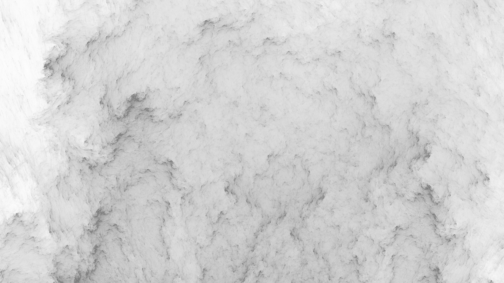

<style>
section {
  font-family: 'Roboto', 'Segoe UI', 'Liberation Sans', 'Helvetica', 'Arial', sans-serif !important;
  font-size: 1.55rem;
  padding: 3.5rem;
  justify-content: start;
}
</style>




<p align="center">
  
</p>


<center>

<br>

# Системный анализ процессов переработки нефти и газа

## Лекция №3 <br> Введение в библиотеку NumPy


<br>
Вячеслав Алексеевич Чузлов

к.т.н., доцент ОХИ ИШПР ТПУ 


---

<!-- paginate: true -->


# Введение

<div class="columns">

<div>

- Библиотека NumPy (**Num**erical **Py**thon – «числовой Python») предоставляет набор эффективных инструментов для хранения и работы с данными.
- Массивы библиотеки NumPy отдаленно напоминают списки Python, однако обеспечивают намного более эффективное хранение и выполнение операций с данными при росте размера массивов.
- Массивы библиотеки NumPy формируют ядро практически всей экосистемы утилит для работы с большими данными (BigData) в Python.

</div>

<div>


> По установившейся традиции, большинство пользователей импортируют пакет NumPy, используя сокращение `np`:

```py
>>> import numpy as np
```

</div>

</div>


---


<style scoped>
  section {
    justify-content: center;
    font-size: 40px;
  }
  h1 {
    /* color: white; */
    padding: 0px 0px 0px 0px;
    height: auto;
    align: justify; 
  }
</style>


   


# Создание массивов NumPy


<!-- _paginate: skip -->

---

# Создание массивов NumPy

- Для того, чтобы создать объект массива NumPy из объекта списка Python, можно использовать функцию `np.array`:

```pycon
>>> import numpy as np
>>> np.array([1, 3, 5, 4, 2]) # Массив целочисленных значений
array([1, 3, 5, 4, 2])
```

- В отличие от стандартных списков Python, массивы NumPy могут содержать элементы только одного типа. Если типы элементов не совпадают, NumPy сделает попытку повышающего приведения типов:

```pycon
>>> np.array([3.14, 4, 2, 3, 2.71])
array([3.14, 4. , 2. , 3. , 2.71])
```

---

# Создание массивов NumPy

- В тех случаях, когда требуется явно задать тип результирующего массива, необходимо воспользоваться ключевым аргументом `dtype`:

```pycon
>>> np.array([1, 3, 5, 4, 2], dtype='float32')
array([1., 3., 5., 4., 2.], dtype=float32)
```

<br>

- В отличие от списков, массивы NumPy можно явным образом описать как многомерные:

```pycon
>>> np.array([range(i, i + 3) for i in [2, 4, 6]])
array([[2, 3, 4],
       [4, 5, 6],
       [6, 7, 8]])
```

---

# Создание массивов NumPy

> Массивы больших размеров эффективнее генерировать с помощью встроенных методов.

- Создаем массив целых чисел длины $10$, заполненный <mark>нулями</mark>:

```pycon
>>> import numpy as np
>>> np.zeros(10, dtype=int)
array([0, 0, 0, 0, 0, 0, 0, 0, 0, 0])
```
<br>

- Создадим массив размером $3 \times 5$ значений с плавающей точкой, заполненный <mark>единицами</mark>:

```pycon
>>> np.ones((3, 5), dtype=float)
array([[1., 1., 1., 1., 1.],
       [1., 1., 1., 1., 1.],
       [1., 1., 1., 1., 1.]])
```

---

# Создание массивов NumPy

- Создадим массив размером $3 \times 5$, заполненный значением $2.98$:

```pycon
>>> np.full((3, 5), 2.98)
array([[2.98, 2.98, 2.98, 2.98, 2.98],
       [2.98, 2.98, 2.98, 2.98, 2.98],
       [2.98, 2.98, 2.98, 2.98, 2.98]])
```

- Создадим массив, заполненный линейной последовательностью, начинающейся с $0$ и заканчивающейся $20$ (<mark>не включая</mark>), с шагом $2$ (аналогично встроенной функции `range()`):

```pycon
>>> np.arange(0, 20, 2)
array([ 0, 2, 4, 6, 8, 10, 12, 14, 16, 18])
```

- Создадим массив из <mark>пяти</mark> значений, *равномерно* располагающихся между $0$ и $1$:

```pycon
>>> np.linspace(0, 1, 5)
array([0. , 0.25, 0.5 , 0.75, 1. ])
```

---

# Создание массивов NumPy

- Создадим массив размером $3 \times 3$ равномерно распределенных случайных значений от $0$ до $1$ (<mark>не включая</mark>):

```pycon
>>> np.random.random((3, 3))
array([[0.28303209, 0.54071726, 0.93183376],
       [0.02403954, 0.92295936, 0.62619599],
       [0.06875703, 0.61762719, 0.47795471]])
```

<br>

- Создадим массив размером $3 \times 3$ случайных целых чисел в интервале $[0; 10)$

```pycon
>>> np.random.randint(0, 10, (3, 3))
array([[3, 6, 7],
       [5, 7, 4],
       [9, 3, 5]])
```

---

# Инициализация массива из функции

- Для создания массива, инициализируемого значениями, которые вычисляются
с помощью некоторой функции, используется метод `np.fromfunction()`,
принимающий в качестве аргументов эту функцию и кортеж, определяющий
форму требуемого массива. 
- Сама функция должна принимать количество аргументов, совпадающее с размерностями создаваемого массива: эти аргументы индексируют каждый элемент, в который функция возвращает значение.

```pycon
>>> import numpy as np
>>> def f(i: int, j: int) -> int:
...     return 2 * j * i
>>> np.fromfunction(f,(4,3))
array([[ 0.,  0.,  0.],
       [ 0.,  2.,  4.],
       [ 0.,  4.,  8.],
       [ 0.,  6., 12.]])
```


---

<style scoped>
  section {
    justify-content: center;
    font-size: 30px
  }
</style>


# Атрибуты массивов NumPy для интроспекции

<!-- _paginate: skip -->


---


# Атрибуты массивов NumPy для интроспекции

> Массив NumPy знает свой ранг, форму, размер, тип `dtype` и другие свойства: их можно определить прямо из специальных атрибутов:

```pycon
>>> import numpy as np
>>> a = np.array(((1, 0, 1), (0, 1, 0)))
>>> a.shape  # 2 строки, 3 столбца
(2, 3)
>>> a.ndim  # Ранг (число измерений)
2
>>> a.size  # Общее количество элементов
6
>>> a.dtype
dtype('int64')
>>> a.data
<memory at 0x102387308>
```

---

# Атрибуты массивов NumPy для интроспекции

|Атрибут|Описание|
|-|-|
|`shape`|Измерения массива: размер массива вдоль каждой из его осей, возвращается как кортеж целых чисел|
|`ndim`|Количество осей (измерений). Обратите внимание: `ndim == len(shape)`|
|`size`|Общее количество элементов в массиве, равное произведению элементов кортежа `shape`|
|`dtype`|Тип данных массива|
|`data`|«Буфер» в памяти, содержащий действительные элементы массива|
|`itemsize`|Размер в байтах каждого элемента|

---

<style scoped>
  section {
    justify-content: center;
    font-size: 30px
  }
</style>


# Стандартные типы данных NumPy

<!-- _paginate: skip -->


---

# Стандартные типы данных NumPy

|<div style="width:200px">Тип данных</div>|Описание|
|-|-|
|`int16`|Целое число (от $–32 \space 768$ до $32 \space 767$)|
|`int32`|Целое число (от $–2 \space 147 \space 483 \space 648$ до $2 \space 147 \space 483 \space 647$)|
|`int64`|Целое число (от $–9 \space 223 \space 372 \space 036 \space 854 \space 775 \space 808$ до $9 \space 223 \space 372 \space 036 \space 854 \space 775 \space 807$)|
|`uint16`|Беззнаковое целое число (от $0$ до $65 \space 535$)|
|`uint32`|Беззнаковое целое число (от $0$ до $4 \space 294 \space 967 \space 295$)|
|`uint64`|Беззнаковое целое число (от $0$ до $18 \space 446 \space 744 \space 073 \space 709 \space 551 \space 615$)|
|`float16`|Число с плавающей точкой с половинной точностью: $1$ бит знак, $5$ бит порядок, $10$ бит мантисса|


---

# Стандартные типы данных NumPy

|<div style="width:200px">Тип данных</div>|Описание|
|-|-|
|`float32`|Число с плавающей точкой с одинарной точностью: $1$ бит знак, $8$ бит порядок, $23$ бита мантисса|
|`float64`|Число с плавающей точкой с удвоенной точностью: $1$ бит знак, $11$ бит порядок, $52$ бита мантисса|
|`complex64`|Комплексное число, представленное двумя $32$-битными числами|
|`complex128`|Комплексное число, представленное двумя $64$-битными числами|

<div class="columns">

<div>

При создании массива тип данных можно указывать с помощью строк:
```pycon
np.zeros(10, dtype='int16')
``` 

</div>

<div>

или соответствующих объектов библиотеки NumPy:
```pycon
np.zeros(10, dtype=np.int16)
```

</div>

</div>

---

<style scoped>
  section {
    justify-content: center;
    font-size: 30px
  }
</style>


# Доступ к элементам массива NumPy

<!-- _paginate: skip -->

---

# Индексация элементов массива NumPy

- В одномерном массиве обратиться к $i$-му (считая с $0$) значению можно по требуемому индексу в квадратных скобках, по аналогии со стандартными списками:

```pycon
>>> import numpy as np
>>> x1 = np.array([5, 0, 3, 3, 7, 9])
>>> x1[0]
5
>>> x1[4]
7
>>> x1[‐1]
9
>>> x1[‐2]
7
```

---

# Индексация элементов массива NumPy

- Для обращения к элементам матрицы нужно указать кортеж индексов,  разделенных запятыми:

```pycon
>>> x2 = np.array([[3, 5, 2, 4], [7, 6, 8, 8], [1, 6, 7, 7]])
>>> x2
array([[3, 5, 2, 4],
       [7, 6, 8, 8],
       [1, 6, 7, 7]])
>>> x2[0, 0]
3
>>> x2[2, 0]
1
>>> x2[2, ‐1]
7
```

---

# Индексация элементов массива NumPy

- При помощи любой из указанных выше нотаций можно изменять значения элементов массива:

```pycon
>>> x2[0, 0] = 24
>>> x2
array([[24, 5, 2, 4],
       [ 7, 6, 8, 8],
       [ 1, 6, 7, 7]])
```

> Следует помнить, что, в отличие от списков, массивы NumPy имеют фиксированный тип данных. Если вставить в массив <mark>*целых*</mark> чисел значение с <mark>*плавающей точкой*</mark>, оно будет <span style="color:red">**неявно усечено**</span>:

```pycon
>>> x1[0] = 2.71828  # Это значение будет усечено!
>>> x1
array([2, 0, 3, 3, 7, 9])
```

---

<style scoped>
  section {
    justify-content: center;
    font-size: 30px
  }
</style>


# Изменение формы массива

<!-- _paginate: skip -->

---

# Методы `flatten()` и `ravel()`

Предположим, что необходимо «выпрямить» многомерный массив вдоль одной оси. Библиотека NumPy предоставляет для этого два метода: `flatten()` и `ravel()`.

- Оба метода создают одномерный массив в соответствии с его внутренним
порядком элементов (по строкам).
- Метод `flatten()` возвращает независимую копию элементов и в общем случае медленнее, чем метод `ravel()`.
- Метод `ravel()` пытается вернуть **представление** преобразованного в одно измерение массива. 

> <span style="color:rgb(255,182,0)">**Представление массива**</span> – это массив NumPy, который в данном случае имеет форму, отличающуюся от формы исходного массива, но не содержит «собственных» элементов данных: он содержит **ссылки** на элементы другого массива.

---

# Методы `flatten()` и `ravel()`

```pycon
>>> a = np.array([[1, 2, 3], [4, 5, 6], [7, 8, 9]])
>>> b = a.flatten()  # Создает независимую, одномерную копию массива a
>>> b
array([1, 2, 3, 4, 5, 6, 7, 8, 9])
>>> b[3] = 0
>>> b
array([1, 2, 3, 0, 5, 6, 7, 8, 9])
>>> a  # Массив a не изменяется
array([[1, 2, 3],
       [4, 5, 6],
       [7, 8, 9]])
```

> Присваивание массиву `b` не изменяет массив `a`, потому что это абсолютно независимые объекты, которые не используют данные совместно.

---

# Методы `flatten()` и `ravel()`

```pycon
>>> c = a.ravel()
>>> c
array([1, 2, 3, 4, 5, 6, 7, 8, 9])
>>> c[3] = 0
>>> c
array([1, 2, 3, 0, 5, 6, 7, 8, 9])
>>> a
array([[1, 2, 3],
       [0, 5, 6],
       [7, 8, 9]])
```

> Необходимо всегда помнить о том, что хотя метод `ravel()` «работает наилучшим образом», возвращая представление внутренних данных, разнообразные операции с массивами (включая вырезание группы элементов (slicing)) могут оставлять элементы хранящимися в несмежных локациях памяти. 
> В этом случае у метода `ravel()` нет другого выбора, кроме создания копии массива.

---

# Метод `resize()`

- Размер массива может быть изменен (для самого исходного массива) с помощью метода `resize,()` который в качестве аргументов принимает новые значения измерений.

<br>

```pycon
>>> a = np.linspace(1, 4, 4)
>>> print(a)
[1. 2. 3. 4.]
>>> a.resize(2, 2)  # Изменяет форму исходного массива, возвращаемого значения нет
>>> print(a)
[[1. 2.]
 [3. 4.]]
```

---

# Метод `reshape()`

- Метод `reshape()` возвращает <mark>представление</mark> исходного массива с изменением его формы. Исходный массив не изменяется, но оба объекта совместно используют внутренние данные.

<br>

```pycon
>>>  a = np.linspace(1, 4, 4)
>>> b = a.reshape(2, 2)
>>> print(a)
[1. 2. 3. 4.]
>>> print(b)
[[1. 2.]
 [3. 4.]]
>>>  b[0, 0] = -99
>>> print(b)
[[-99. 2.]
 [  3. 4.]]
>>>  print(a)
[-99. 2. 3. 4.]
```

---

# Метод `reshape()`

- Если требуется поместить числа от $1$ до $9$ в таблицу $3 \times 3$:

```pycon
>>> grid = np.arange(1, 10).reshape((3, 3))
>>> print(grid)
[[1 2 3]
 [4 5 6]
 [7 8 9]]
```

> <span style="color:orange">*Размер исходного массива должен соответствовать размеру измененного!*</span>

- Другой часто используемый паттерн изменения формы – преобразование одномерного массива в двумерную матрицу-строку или матрицу-столбец. Для этого можно применить метод `reshape()`, но лучше воспользоваться ключевым словом `newaxis` при выполнении операции среза:

```pycon
>>>  x = np.array([1, 2, 3])
>>> x.reshape((1, 3))  # преобразование в вектор-строку
array([[1, 2, 3]])
```

---

# Метод `reshape()`

```pycon
>>> x[np.newaxis, :]  # Преобразование в вектор‐строку посредством newaxis
array([[1, 2, 3]])
>>> x.reshape((3, 1))  # Преобразование в вектор‐столбец с помощью reshape
array([[1],
       [2],
       [3]])
>>> x[:, np.newaxis]  # Преобразование в вектор‐столбец посредством newaxis
array([[1],
       [2],
       [3]])
```

---

# Транспонирование массива

- Метод `transpose()` возвращает представление массива с транспонированными осями. Для двумерного массива это обычная операция транспонирования матрицы:

```pycon
>>> a = np.linspace(1, 6, 6).reshape(3, 2)
>>> a
array([[1., 2.],
       [3., 4.],
       [5., 6.]])
>>> a.transpose()  # Или просто a.T
array([[1., 3., 5.],
       [2., 4., 6.]])
```

- Транспонирование одномерного массива возвращает этот же неизмененный массив:

```pycon
>>> b = np.array([100, 101, 102, 103])
>>> b.T
array([100, 101, 102, 103])
```

---

# Объединение массивов

- Слияние, или объединение, двух массивов в библиотеке NumPy выполняется в основном с
помощью функций `np.concatenate()`, `np.vstack()` и `np.hstack()`.
- Функция `np.concatenate()` принимает на входе кортеж или список массивов в качестве
первого аргумента:


```pycon
>>> x = np.array([1, 2, 3])
>>> y = np.array([3, 2, 1])
>>> np.concatenate([x, y])
array([1, 2, 3, 3, 2, 1])
```

- Можно объединять более двух массивов одновременно:

```pycon
>>> z = [99, 99, 99]
>>> print(np.concatenate([x, y, z]))
[ 1 2 3 3 2 1 99 99 99]
```

---

# Объединение массивов

- Для объединения двумерных массивов можно также использовать `np.concatenate()`:

<br>

```pycon
>>> grid = np.array([[1, 2, 3], [4, 5, 6]])
>>> np.concatenate([grid, grid])  # слияние по первой оси координат
array([[1, 2, 3],
       [4, 5, 6],
       [1, 2, 3],
       [4, 5, 6]])
>>> np.concatenate([grid, grid], axis=1)  # слияние по второй оси координат
array([[1, 2, 3, 1, 2, 3],
       [4, 5, 6, 4, 5, 6]])
```

---

# Объединение массивов

- Для работы с массивами с различающимися измерениями удобнее и понятнее использовать функции `np.vstack()` (вертикальное объединение) и `np.hstack()` (горизонтальное объединение):

<br>

```pycon
>>> x = np.array([1, 2, 3])
>>> grid = np.array([[9, 8, 7], [6, 5, 4]])
>>> np.vstack([x, grid])  # Объединяет массивы по вертикали
array([[1, 2, 3],
       [9, 8, 7],
       [6, 5, 4]])
>>> y = np.array([[99], [99]])  #  Объединяет массивы по горизонтали
>>> np.hstack([grid, y])
array([[ 9, 8, 7, 99],
       [ 6, 5, 4, 99]])
```

---

# Разбиение массивов

- Противоположностью слияния является разбиение, выполняемое с помощью функций `np.split()`, `np.hsplit()` и `np.vsplit()`.

- Каждой из них необходимо передавать список индексов, задающих точки раздела:

```pycon
>>> x = [1, 2, 3, 99, 99, 3, 2, 1]
>>> x1, x2, x3 = np.split(x, [3, 5])
>>> print(x1, x2, x3)
[1 2 3] [99 99] [3 2 1]
```

- Обратите внимание, что $N$ точек раздела означают $N + 1$ подмассив.

---

# Разбиение массивов

- Соответствующие функции `np.hsplit()` и `np.vsplit()` действуют аналогично:

```pycon
>>> grid = np.arange(16).reshape((4, 4))
>>> grid
array([[ 0,  1,  2, 3],
       [ 4,  5,  6, 7],
       [ 8,  9, 10, 11],
       [12, 13, 14, 15]])
>>> upper, lower = np.vsplit(grid, [2])
>>> print(upper)
[[0 1 2 3]
 [4 5 6 7]]
>>> print(lower)
[[ 8 9 10 11]
 [12 13 14 15]]
```

---

# Разбиение массивов

```pycon
>>> left, right = np.hsplit(grid, [2])
>>> print(left)
[[ 0 1]
 [ 4 5]
 [ 8 9]
 [12 13]]
>>> print(right)
[[ 2 3]
 [ 6 7]
 [10 11]
 [14 15]]
```

---

# Разбиение массивов

- Если вторым аргументом является последовательность целочисленных индексов, то массив разделяется по этим индексам:

```pycon
>>> a
array([0, 1, 2, 3, 4, 5])
>>> np.hsplit(a, (2, 3, 5))
[array([0, 1]), array([2]), array([3, 4]), array([5])]
```

> Здесь последовательность целочисленных аргументов  – то же самое, что список <br> `[a[:2], a[2:3], a[3:5], a[5:]]`. В отличие от группы функций `np.hstack()` и т.д., возвращаемые массивы являются представлениями исходных данных.

---

<style scoped>
  section {
    justify-content: center;
    font-size: 30px
  }
</style>


# Анонимные (`lambda`) функции

<!-- _paginate: skip -->

---

# Анонимные (`lambda`) функции

- Помимо инструкции `def` в языке Python имеется возможность создавать объекты функций в форме выражений.
- Подобно инструкции `def` это выражение создает функцию, которая будет вызвана позднее, но в отличие от инструкции `def`, выражение возвращает функцию, а не связывает ее с именем.
- Именно поэтому `lambda`-выражения иногда называют анонимными (т.е. безымянными) функциями.
- На практике они часто используются как способ получить встроенную функцию или отложить выполнение фрагмента программного кода.
- Общая форма `lambda`-функций выглядит как ключевое слово `lambda`, за которым следует один или больше аргументов (очень похоже на список аргументов, заключенный в круглые скобки в заголовке `def`) и далее выражение после двоеточия:
```py
lambda arg1, arg2, ..., argN: expression
```

---

# Анонимные (`lambda`) функции

- Тело `lambda` является одиночным выражением, а не блоком операторов и похоже на то, что
было бы указано в операторе `return` внутри тела `def`.
- Из-за ограничения только выражением, тело `lambda` менее универсально, чем `def` – можно
помещать в тело `lambda` лишь определенную логику, не использующую операторы вроде `if`.
- Так было задумано, чтобы ограничить вложенность в программе: выражение `lambda` предназначено для записи простых функций, а оператор `def` можно использовать для решения более крупных задач.

<div class="columns">

<div>

```py
def f(x: int, y: int) -> int:
    return x + y

print(f(1, 2))  # 3
```

</div>

<div>

```py
f = lambda x, y: x + y
print(f(1, 2))  # 3


```

</div>

</div>


---

# Использование `lambda`-выражений

- Выражение `lambda` полезно как своего рода краткое условное обозначение функции,
которое позволяет встраивать определение функции внутрь кода, где оно применяется.

- В сценариях, где нужно всего лишь встраивать небольшие порции кода, выражения `lambda`
окажутся более простыми кодовыми конструкциями, чем операторы `def`.

```py
from random import randint

x = [randint(-5, 5) for _ in range(10)]
print(x)  # [‐4, ‐2, ‐4, 2, ‐5, 0, ‐4, 4, ‐5, ‐3]

print(min(x, key=lambda x: x ** 2 - 9 * x + 5))  # 4
```

- Фактически, поиск минимума происходил в этом списке:

```py
print([num ** 2 - 9 * num + 5 for num in x])  # [57, 27, 57, ‐9, 75, 5, 57, ‐15, 75, 41]
```

но результат – соответсвующий элемент из списка `x`.

---

# Использование `lambda`-выражений

- Выражения `lambda` широко используются при реализации таблиц переходов, которые представляют собой списки или словари действий, подлежащих выполнению по запросу.

```py
function_list = [
    lambda x: x ** 2,
    lambda x: x ** 3,
    lambda x: x ** 4
]

for f in function_list:
    print(f(3), end=' ')

print()
print(function_list[0](5))

# 9 27 81
# 25
```

---

# Использование `lambda`-выражений

- Эквивалентный код с `def` потребовал бы временных имен функций (возможны конфликты с остальными именами) и определений функций за пределами контекста их планируемого применения (который может находиться на сотни строк дальше):

```py
def f1(x: int) -> int:
    return x ** 2

def f2(x: int) -> int:
    return x ** 3

def f3(x: int) -> int:
    return x ** 4

function_list = [f1, f2, f3]
for f in function_list:
    print(f(3), end=' ')

print()
print(function_list[0](5))
# 9 27 81
# 25
```

---

# Использование `lambda`-выражений

- В действительности можно использовать словари и другие структуры данных в Python для построения более универсальных разновидностей таблиц действий:

```py
key = 'got'

actions = {
    'already': lambda: 2 + 2,
    'got': lambda: 5 * 5,
    'one': lambda: 2 ** 6,
}

print(actions[key]())  # 25
```

- Когда Python создает словарь `actions`, каждое вложенное выражение `lambda` генерирует функцию, подлежащую вызову в будущем.
- Индексация по ключу извлекает одну из функций, а круглые скобки приводят к вызову извлеченной функции.
- Таким образом, словарь становится инструментом для множественного ветвления.

---

<style scoped>
  section {
    justify-content: center;
    font-size: 30px
  }
</style>

.webp)

# Функции генераторы

<!-- _paginate: skip -->


---

# Функции-генераторы 

- <span style="color: #ffb600;">**Функция-генератор**</span> – это функция, которая может возвращать значение, а позднее продолжить свою работу с того места, где она была приостановлена.
- Такая функция генерирует последовательность значений с течением времени, а также автоматически поддерживает протокол итераций и может использоваться в контексте итераций.
- Функции-генераторы записываются как обычные операторы `def`, но в них применяются операторы `yield`, вместо операторов `return`.
- Функция-генератор возобновляет работу, ее выполнение продолжается с первой
инструкции, следующей после оператора `yield`. Это позволяет функциям воспроизводить последовательности значений в течение долгого времени, вместо того, чтобы создавать всю последовательность сразу и возвращать ее в виде некоторой конструкции, такой как список.


---

# Функции-генераторы 

- Определим функцию-генератор, которую можно применять для получения квадратов серии чисел с течением времени:

```py
def generate_squares(n):
    for x in range(n):
        yield x ** 2
```

- Функция `generate_squares` выдает значение и возвращает управление вызывающему коду на каждой итерации цикла; при возобновлении ее выполнения восстанавливается предыдущее состояние, включая последние значения переменных `x` и `n`, а управление снова подхватывается непосредственно после оператора `yield`.

```py
for i in generate_squares(5):
    print(i, end=' | ')

#  0 | 1 | 4 | 9 | 16 |
```

---

# Функции-генераторы 

- Возвращенный объект генератора имеет метод `__next__()`, который запускает функцию или возобновляет ее выполнение с места, откуда она последний раз выдала значение, и инициирует исключение `StopIteration`, когда достигнут конец серии значений.
- Встроенная функция `next()` вызывает метод `__next__()` итерируемого объекта:
```py
fg = generate_squares(5)
print(next(fg))  # 0
print(next(fg))  # 1
print(next(fg))  # 4
print(next(fg))  # 9
print(next(fg))  # 16
print(next(fg))  # StopIteration
```

- После использования итерации по генератору, он **останется пустым**. Для повторной итерации придется создать новый объект генератора.

---

<style scoped>
  section {
    justify-content: center;
    font-size: 30px;
    
  }
</style>

<!-- _paginate: skip -->


<br>

<center>

<!--  -->


<br>

# Благодарю за внимание!

<br>

Вячеслав Алексеевич Чузлов
к.т.н., доцент ОХИ ИШПР

</center>
